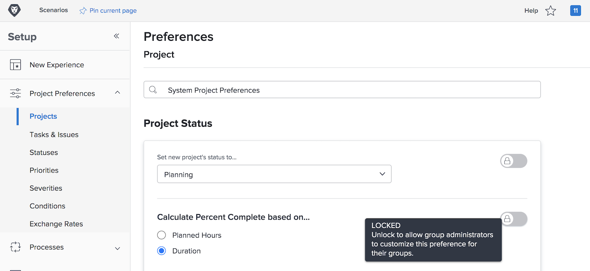

# Konfigurera globala standardprojektinställningar

<!---
21.4 updates have been made
--->

I den här videon får du lära dig att:

* Ändra en anpassad status
* Ange globala projektinställningar
* Skapa och använda scheman

>[!VIDEO](https://video.tv.adobe.com/v/335065/?quality=12&learn=on)

## Globala inställningar och inställningar för gruppprojekt, aktiviteter och ärenden

När du öppnar inställningarna för [!UICONTROL Projekt] i [!DNL Workfront] visas &quot;[!UICONTROL Systemprojektinställningar]&quot; i sökfältet högst upp i fönstret. Detta talar om för dig att de här inställningarna påverkar alla i [!DNL Workfront]-systemet - det är en global konfiguration.

Sidan ![[!UICONTROL Projektinställningar] i [!UICONTROL Inställningar]](assets/admin-fund-system-project-preferences-1.png)

Du kommer att se något liknande när du öppnar inställningarna för [!UICONTROL Aktiviteter och problem] .

![[!UICONTROL Inställningar för aktivitet och problem] i [!UICONTROL Inställningar]](assets/admin-fund-task-issue-preferences-2.png)

Det är dock möjligt att inte alla grupper i [!DNL Workfront] behöver samma inställningar för projekt, aktivitet och utgåvor. Marknadsföringsgruppen vill till exempel att ett nytt projekts status ska vara Planering medan projektledningsgruppen föredrar statusen Begäran.

Med [!DNL Workfront] kan gruppadministratörer justera vissa projekt-, uppgifts- och utfärdar-inställningar för sina grupper. Vilka inställningar som kan justeras bestäms av [!DNL Workfront]-systemadministratören med hjälp av låsnings-/upplåsningsväxlarna.

Börja med att navigera till [!UICONTROL inställningsområdet]:

1. Välj **[!UICONTROL Konfigurera]** på **[!UICONTROL huvudmenyn]**.
1. Expandera **[!UICONTROL Projektinställningar]** på den vänstra menyn.
1. Välj **[!UICONTROL Projekt]** eller **[!UICONTROL Åtgärder och problem]**, beroende på vilka inställningar du vill ändra.

Lås en inställning om du inte vill att gruppadministratörer ska kunna justera den inställningen för sin grupp.

Lås upp inställningen så att den blir tillgänglig för gruppadministratörer att anpassa.

Vissa inställningar kan inte låsas upp och förblir globala systeminställningar.

### Ange inställningar för grupper och undergrupper

För alla inställningar som låsts upp av systemadministratören kan gruppadministratörerna göra justeringar för de grupper de hanterar och eventuella undergrupper som är kapslade under dessa grupper. Dessutom kan gruppadministratörer styra vilka inställningar deras undergruppsadministratörer kan ändra.

1. Välj **[!UICONTROL Konfigurera]** på **[!UICONTROL huvudmenyn]**.
1. Klicka på **[!DNL Groups]** på den vänstra menyn.
1. Klicka på gruppens eller undergruppens namn för att öppna den.
1. Välj **[!UICONTROL Projektinställningar]** eller **[!UICONTROL Inställningar för aktiviteter och problem]** på den vänstra menyn.
1. Gör de ändringar som behövs för varje inställning som har låsts upp.
1. Välj **[!UICONTROL Spara]**.

![[!UICONTROL Avsnittet Projektstatus] på [!UICONTROL sidan Grupp]](assets/admin-fund-group-preferences.png)

Om din organisation inte använder gruppadministratörer kan systemadministratören hantera inställningarna för de olika grupperna.

<!---
learn more URLs and guides
Create or edit a group status 
Group administrators 
Configure system-wide project preferences 
Configure project preferences for a group 
Configure task and issue preferences for a group 
Create and modify a group’s schedule 
--->
