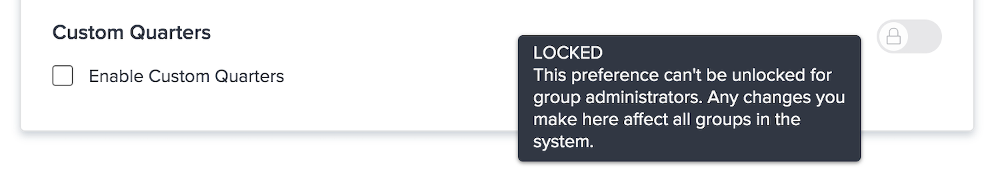

# Konfigurera globala standardprojektinställningar

<!---
21.4 updates have been made
--->

I den här videon får du lära dig att:

* Ändra en anpassad status
* Ange globala projektinställningar
* Skapa och använda scheman

>[!VIDEO](https://video.tv.adobe.com/v/335065/?quality=12&learn=on)

## Globala inställningar och inställningar för gruppprojekt, aktiviteter och ärenden

När du öppnar [!UICONTROL Projekt] inställningar i [!DNL Workfront]kommer du att märka att det står &quot;[!UICONTROL Inställningar för systemprojekt]&quot; i sökfältet högst upp i fönstret. Detta gör att du vet att de här inställningarna påverkar alla i [!DNL Workfront] system - det är en global konfiguration.

![[!UICONTROL Projektinställningar] sida in [!UICONTROL Inställningar]](assets/admin-fund-system-project-preferences-1.png)

Du ser något liknande när du öppnar [!UICONTROL Uppgifter och problem] inställningar.

![[!UICONTROL Inställningar för aktivitet och problem] in [!UICONTROL Inställningar]](assets/admin-fund-task-issue-preferences-2.png)

Men det är möjligt att inte alla grupper i [!DNL Workfront] behöver samma projekt-, uppgifts- och probleminställningar. Marknadsföringsgruppen vill till exempel att ett nytt projekts status ska vara Planering medan projektledningsgruppen föredrar statusen Begäran.

[!DNL Workfront] gör att gruppadministratörer kan justera vissa projekt-, uppgifts- och utgivningsinställningar för sina grupper. Vilka inställningar som kan justeras bestäms av [!DNL Workfront] systemadministratör som använder lås-/upplåsningsväxlarna.

Börja med att navigera till [!UICONTROL Inställningar] område:

1. Välj **[!UICONTROL Inställningar]** i **[!UICONTROL Huvudmeny]**.
1. Expandera **[!UICONTROL Projektinställningar]** i den vänstra menyn.
1. Välj **[!UICONTROL Projekt]** eller **[!UICONTROL Uppgifter och problem]**, beroende på vilka inställningar du vill ändra.

Lås en inställning om du inte vill att gruppadministratörer ska kunna justera den inställningen för sin grupp.

Lås upp inställningen så att den blir tillgänglig för gruppadministratörer som kan anpassa den.

Vissa inställningar kan inte låsas upp och förblir globala systeminställningar.

### Ange inställningar för grupper och undergrupper

För alla inställningar som låsts upp av systemadministratören kan gruppadministratörerna göra justeringar för de grupper de hanterar och eventuella undergrupper som är kapslade under dessa grupper. Dessutom kan gruppadministratörer styra vilka inställningar deras undergruppsadministratörer kan ändra.

1. Välj **[!UICONTROL Inställningar]** i **[!UICONTROL Huvudmeny]**.
1. Klicka **[!DNL Groups]** i den vänstra menyn.
1. Klicka på gruppens eller undergruppens namn för att öppna den.
1. Välj **[!UICONTROL Projektinställningar]** eller **[!UICONTROL Inställningar för uppgifter och ärenden]** i den vänstra menyn.
1. Gör de ändringar som behövs för varje inställning som har låsts upp.
1. Välj **[!UICONTROL Spara]**.

![[!UICONTROL Projektstatus] avsnitt på [!UICONTROL Grupp] page](assets/admin-fund-group-preferences.png)

Om din organisation inte använder gruppadministratörer kan systemadministratören hantera inställningarna för de olika grupperna.

<!---
learn more URLs and guides
Create or edit a group status 
Group administrators 
Configure system-wide project preferences 
Configure project preferences for a group 
Configure task and issue preferences for a group 
Create and modify a group’s schedule 
--->
