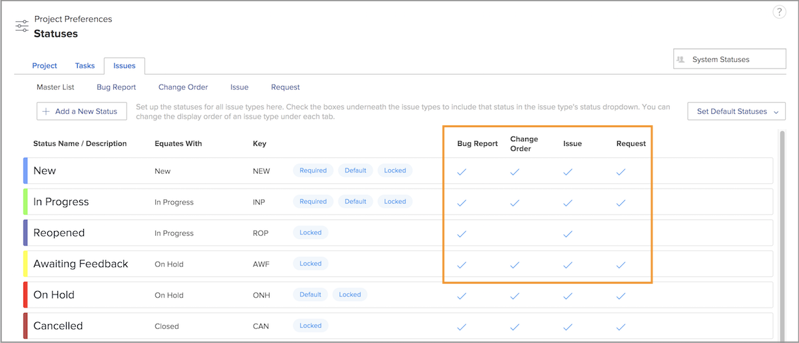

# Anpassa systemomfattande statusar

[!DNL Workfront] innehåller en mängd standardstatusvärden som passar din organisations arbetsflöden för ärendehantering. Dessa statusvärden kan namnändras så att de matchar organisationens terminologi. Och status kan tilldelas specifika utgåvor.

Ytterligare statusar kan skapas vid behov. Det är bara systemadministratörer som kan skapa systemomfattande statusar. Dessutom styr systemadministratörer vilka statusvärden som kan redigeras av gruppadministratörer.

Fliken ![[!UICONTROL Problem] på sidan [!UICONTROL Status] i [!UICONTROL Inställningar]](assets/admin-fund-all-issue-statuses.png)

## Ändra befintlig status

[!DNL Workfront] rekommenderar ett minsta antal statusvärden. Detta gör det enklare för användarna att välja rätt status och ger en kortare lista över status att underhålla.

Du kan redigera en befintlig status för att ändra namnet, vilka utgåvetyper det är kopplat till, den relaterade färgen osv.

![Statuslista för problem med alternativet [!UICONTROL Redigera] markerat](assets/admin-fund-edit-issue-status.png)

1. Klicka på **[!UICONTROL Konfigurera]** på **[!UICONTROL Huvudmenyn]**.
1. Expandera avsnittet **[!UICONTROL Projektinställningar]** på den vänstra menypanelen.
1. Välj **[!UICONTROL Status]**.
1. Välj fliken **[!UICONTROL Problem]** och kontrollera att [!UICONTROL Systemstatus] visas i det övre högra hörnet.
1. Välj **[!UICONTROL Huvudlista]** om du vill visa statusvärdena för alla utgåvor. Här skapar eller ändrar du en ärendestatus.
1. Håll markören över den högra sidan av statusen som du vill ändra namn på och klicka på **[!UICONTROL Redigera]**.
1. Ge statusen ett nytt namn eller ändra någon annan information efter behov.
1. Lås statusen om de här inställningarna ska gälla för alla användare i din [!DNL Workfront]-instans.
1. Lås upp statusen så att gruppadministratörer bara kan redigera statusen för sina grupper.
1. Markera rutorna för den utgåva som statusen ska gälla för.
1. Klicka på **[!UICONTROL Spara]**.

### Statustilldelningar

Alla statusvärden kan inte tilldelas alla utgåvor. Sidan [!UICONTROL Status] innehåller kolumner som visar vilken typ av problem som respektive status kan användas för.

Om du bara vill se statusvärdena som tilldelats en viss utgåva klickar du bara på problemtypens namn högst upp i fönstret.

![[!UICONTROL Problem] på [!UICONTROL Status]-sidan med kolumner markerade](assets/admin-fund-statuses-issue-type.png)

Härifrån kan du dra och släppa problemen i den ordning du vill att de ska visas i listrutan [!UICONTROL Status] .

Om du vill redigera statusarna måste du gå tillbaka till [!UICONTROL huvudlistan].
