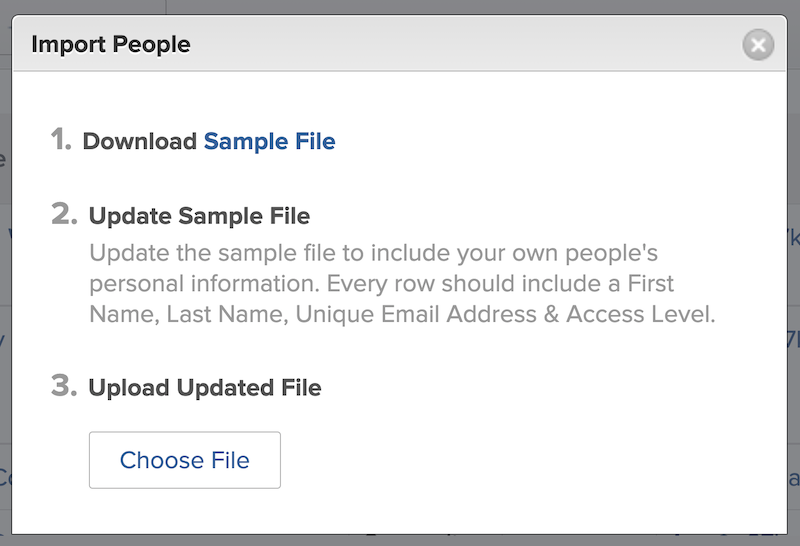

# Lägga till flera användare samtidigt

Att lägga till användare en åt gången kan vara tidskrävande och överväldigande. [!DNL Workfront] låter en systemadministratör lägga till flera användare samtidigt med hjälp av importfunktionen.

![[!UICONTROL Importera personer] menyalternativ](assets/admin-fund-adding-users-5.png)

1. Välj **[!UICONTROL Användare]** från [!UICONTROL Huvudmeny].
1. Markera pilen på **[!UICONTROL Ny person]** och markera **[!UICONTROL Importera personer]**.
1. Fönstret som öppnas visar hur du skapar ett kalkylblad med de användare som ska importeras.
1. Ladda ned exempelfilen, som är en [!DNL Excel] kalkylblad.
1. Uppdatera kalkylbladet med användarinformation - förnamn, efternamn, e-postadress, åtkomstnivå - enligt instruktionerna i själva filen.
1. Välj **[!UICONTROL Välj fil]** när användarlistan har sparats.
1. Navigera till användarens kalkylbladsfil och markera den.

De importerade användarna visas i dialogrutan [!UICONTROL Användare] lista. Redigera informationen om enskilda eller flera användare, om det behövs.

## Importera användare: Använda sparkstarter

[!DNL Workfront] innehåller en startmall för att importera data till systemet. Den kan även användas för att importera användare. Innan du använder snabbstarten [!DNL Workfront] rekommenderar att du arbetar med [!DNL Workfront] konsult, eftersom det finns överväganden du bör vara medveten om.

<!---
paragraph below needs URL to article
--->

Mer information finns i Importera data till Workfront via Quick-Starts.

![[!UICONTROL Importera data] ([!UICONTROL Spark-Starts]) i [!UICONTROL Inställningar] area](assets/admin-fund-adding-users-8.png)

<!--
Learn more URLs
Import users
Import data into Workfront via Kick-Starts
-->
