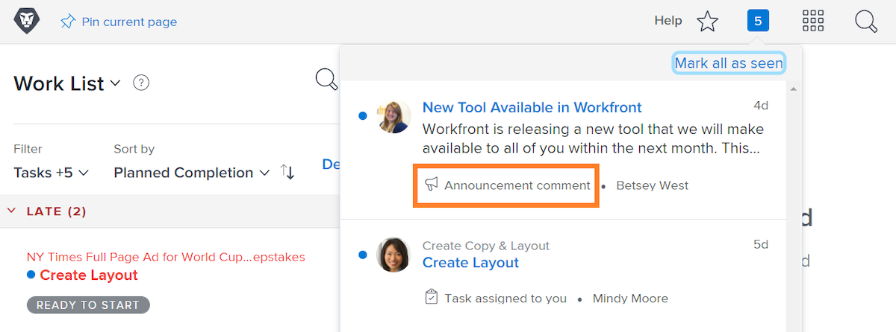
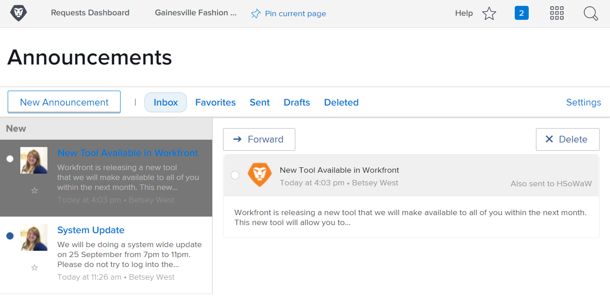

<!---
this has the same content as the system administrator notification setup and mangement section of the email and inapp notificiations learning path
--->

# Skicka [!UICONTROL meddelanden från meddelandecentret]

[!UICONTROL Notiscenter] är en central plats där systemadministratörer kan ta emot meddelanden från [!DNL Workfront] eller skicka meddelanden till organisationens [!DNL Workfront]-användare.

[!DNL Workfront] skickar meddelanden till systemadministratörer om programvarureleaser, kommande webbinarier, systemunderhåll med mera. [!UICONTROL Notiscenter] placerar all den här viktiga informationen på ett ställe, så att du inte förlorar den bland andra meddelanden i din e-postinkorg.

Meddelandeikonen visar olästa meddelanden och meddelanden som skickats via [!DNL Workfront]. Meddelanden i listan är märkta och klickbara om du vill öppna den.

Systemadministratörer kan också använda [!UICONTROL Notiscenter] för att skicka [!DNL Workfront]-omfattande meddelanden till användare. Du kan skicka påminnelser om vem du ska kontakta för att få support, ge dig ett&quot;tips på dagen&quot; med mera.

![[!UICONTROL Alla meddelanden] länk](assets/admin-fund-announcements-2.png)

**Skicka ett meddelande**

1. Klicka på **meddelandeikonen**.
1. Klicka på **[!UICONTROL Alla meddelanden]**.
1. Klicka på knappen **[!UICONTROL Nytt meddelande]**. Som standard fyller raden [!UICONTROL Skicka till] i [!UICONTROL Alla] för att skicka ett meddelande till alla [!DNL Workfront]-användare. Du kan ta bort detta och ange namn på användare, jobbroller, team, grupper eller företag.
1. Ange en ämnesrad.
1. Skriv sedan texten i meddelandet med redigeringsverktygen.
1. Bifoga filer som ska delas genom att klicka på knappen **[!UICONTROL Lägg till bifogad fil]** om det är tillämpligt.
1. Klicka på **[!UICONTROL Skicka]**.

![Skriver ett meddelande på sidan [!UICONTROL Meddelanden]](assets/admin-fund-announcements-3.png)

Meddelandeområdet ser ut som en inkorg med mottagna meddelanden i den vänstra panelen. Klicka på ett meddelande för att läsa det.

