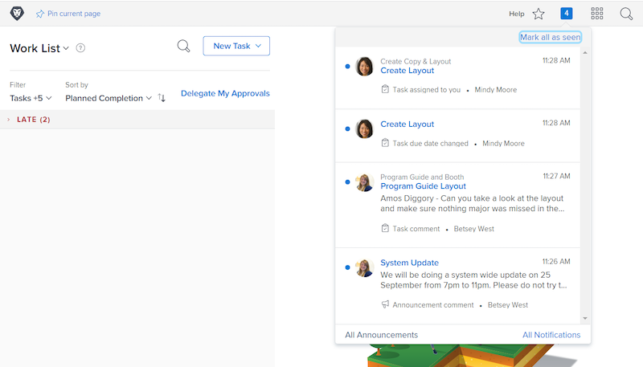
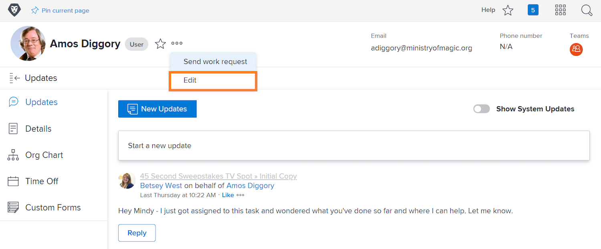

# Hantera händelseaviseringar i appar och e-post

E-post är en del av det dagliga arbetslivet och, vissa dagar, är mängden e-post som du får överväldigande. Med [!DNL Workfront]kan systemadministratörer se till att alla får relevanta och användbara e-postmeddelanden om det arbete de arbetar med.

Det finns flera typer av meddelanden som Workfront kan skicka till användare. Vissa av dessa meddelanden styrs på systemnivå och påverkar alla användare. Vissa meddelanden kan ställas in så att e-postmeddelanden genereras direkt i en daglig sammanfattning. Eller stäng av e-postmeddelanden så genereras endast meddelanden inifrån Workfront.

## Händelsemeddelanden

En händelse är till exempel en statusändring, en publicerad kommentar eller en tilldelad händelse och kan utlösa ett meddelande i appen i [!DNL Workfront].

Du kan dock bestämma vilka händelser du vill få e-postmeddelanden för genom att markera eller avmarkera alternativen i inställningarna.

Klicka på ditt namn på menyn för att göra ändringarna [!UICONTROL Huvudmeny].

![Användarnamn i [!UICONTROL Huvudmeny]](assets/admin-fund-user-notifications-02.png)

Klicka [!UICONTROL Redigera] från [!UICONTROL Mer] -menyn.

Klicka [!UICONTROL Meddelanden] i [!UICONTROL Redigera person] popup-ruta.

![[!UICONTROL Redigera person] window](assets/admin-fund-user-notifications-04.png)

Härifrån kan du bestämma vilka meddelanden du vill få direkt, dagligen eller inte alls. Alla ändringar du gör här är specifika för dig och påverkar inte andra användare i Workfront.

**[!UICONTROL Dagligen]**

Som standard är e-postmeddelanden konfigurerade att skickas direkt. Du kan dock ändra frekvensen för e-postmeddelanden från [!UICONTROL Direkt] till [!UICONTROL Dagligen]och ser till att du får den information du behöver, när du vill ha den.

![[!UICONTROL Meddelande] avsnitt i [!UICONTROL Redigera person] window](assets/admin-fund-user-notifications-05.png)

Det dagliga alternativet skickar en sammanfattning av dagens händelser i ett e-postmeddelande. Användarna får ett e-postmeddelande för varje grupp de ser i dialogrutan [!UICONTROL Meddelanden] -avsnitt.

Till exempel [!UICONTROL Information om projekt som jag äger] -avsnittet kommer att generera ett dagligt e-postmeddelande, [!UICONTROL Åtgärd krävs] kommer att generera ett dagligt e-postmeddelande, osv.

![[!UICONTROL Daglig sammandrag] e-post för [!UICONTROL Information om projekt som jag äger]](assets/admin-fund-user-notifications-06.png)

![[!UICONTROL Daglig sammandrag] e-post för [!UICONTROL Åtgärd krävs]](assets/admin-fund-user-notifications-07.png)

Förutom att välja alternativet för dag anger du en tid för när dessa e-postmeddelanden ska skickas. Beroende på vad som fungerar bäst kan e-postmeddelanden skickas innan du kommer till jobbet på morgonen eller precis innan du går till jobbet.

![[!UICONTROL E-posta daglig sammandrag efter] nedrullningsbar meny i [!UICONTROL Redigera person] window](assets/admin-fund-user-notifications-08.png)

**Inte alls**

Det sista alternativet är att inaktivera e-postmeddelanden helt.

![Markerat meddelande inaktiverat [!UICONTROL Redigera person] window](assets/admin-fund-user-notifications-09.png)

Om du bestämmer dig för att göra detta, tänk på att även om du inte får e-post, så tilldelas arbetet fortfarande, kommenteras och uppdateras inom [!DNL Workfront]. Genom att stänga av alla meddelanden kan du sakna viktig information som du måste känna till.

Det finns några tillfällen när [!DNL Workfront] har sett användare stänga av e-postmeddelanden. Om du till exempel gör mer av ditt arbete via [!DNL Workfront] mobilappen kan du inaktivera e-postmeddelanden och få meddelanden endast via appen.

Oavsett [!UICONTROL Händelsemeddelanden] om du bestämmer dig för att få meddelanden är viktiga för att arbetet med organisationens mål ska lyckas.

## Recommendations

Det finns ett par meddelanden om att [!DNL Workfront] rekommenderar att du lämnar markerat, antingen för ett snabbmeddelande eller för en daglig sammanfattning.

För de flesta användare:

* [!UICONTROL En föregångare till en av mina uppgifter har slutförts]
* [!UICONTROL Någon inkluderar mig i en dirigerad uppdatering]
* [!UICONTROL Någon kommenterar mitt arbetsobjekt]
* [!UICONTROL Förfallodatumet ändras för en uppgift som jag har tilldelats till]

Särskilt för projektledare:

* [!UICONTROL Ett projekt som jag håller på att bli aktivt]
* [!UICONTROL Ett projekt som jag äger kommer efter]
* [!UICONTROL Ett problem har lagts till i ett projekt som jag äger]
* [!UICONTROL Milstolpeaktiviteten har slutförts i ett projekt som jag äger]

<!---
learn more URLs
Email notifications
guide: manage your notifications
--->
