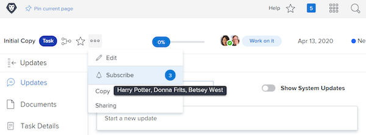

# Prenumerera på arbetsobjekt

Händelsemeddelanden uppdaterar dig om arbete som du har tilldelats. Det kan dock finnas tillfällen när du vill följa arbetsobjekt som du inte är tilldelad eftersom det kan påverka arbetet. Att prenumerera på ett visst objekt är den perfekta lösningen.

Du är till exempel intresserad av förloppet för den inledande kopieringen. Du har inte tilldelats den här uppgiften, men du ansvarar för att redigera den ursprungliga kopian och vill veta vad som pågår. Du kan prenumerera på uppgiften och, när uppdateringar görs, få ett e-postmeddelande med en realtidsuppdatering om hur arbetet fortskrider.

Observera att e-postmeddelanden om prenumerationer och meddelanden i appen endast skickas när kommentarer görs om objektet. E-postmeddelanden och meddelanden skickas inte om andra åtgärder, till exempel ändringar av förfallodatum eller tilldelningsändringar.

Om du vill prenumerera på ett arbetsobjekt måste du ha minst behörigheten Visa delning för det objektet.

![[!UICONTROL Aktivitetsåtkomst] window](assets/admin-fund-user-notifications-11.png)

När du har tillgång till arbetsposten kan du prenumerera på den genom att:

1. Gå till startsidan för projektet, uppgiften eller utgåvan.
1. Klicka på **[!UICONTROL Åtgärder]** -menyn.
1. Klicka **[!UICONTROL Prenumerera]**.

![[!UICONTROL Prenumerera] alternativ på aktivitetsmenyn](assets/admin-fund-user-notifications-12.png)

Du kan se vem som har skrivit på arbetsuppgiften genom att hålla markören över numret bredvid [!UICONTROL Prenumerera/Avbeställ] på menyn.

Om du har [!UICONTROL Hantera] eller [!UICONTROL Dela] behörighet till arbetsposten kan du prenumerera på andra användare för ett projekt, en uppgift eller ett problem genom att:

1. Klicka på siffran bredvid **[!UICONTROL Prenumerera]** alternativ.
1. Lägger till namnet på personen/personerna som du vill prenumerera på arbetsposten.
1. Klicka **[!UICONTROL Spara]**.

![[!UICONTROL Prenumerera] window](assets/admin-fund-user-notifications-15.png)

De personer du prenumererar på meddelas inte om prenumerationen. Alla prenumeranter får behörigheten Visa för objektet. Om abonnenten redan hade [!UICONTROL Contribute] eller [!UICONTROL Hantera] behörigheter till objektet, dessa behörigheter ändras inte.

En post i [!UICONTROL Uppdateringar] på den enskilda posten anger också vem som prenumererade och när. The [!UICONTROL Uppdateringar] loggar också när en användare prenumererar av någon annan.

![[!UICONTROL Uppdateringar] sida för en aktivitet som visar prenumeration](assets/admin-fund-user-notifications-16.png)

Om du vill avbryta prenumerationen på en användare klickar du på bubblan igen för att öppna [!UICONTROL Prenumeranter] -fönstret. Klicka sedan på X bredvid personens namn. Användaren får inget meddelande om att han/hon har avbeställt prenumerationen.

![[!UICONTROL Avbeställ] menyalternativ i ett projekt](assets/admin-fund-user-notifications-14.png)

<!---
learn more URL: Subscribe to items in Workfront
--->
