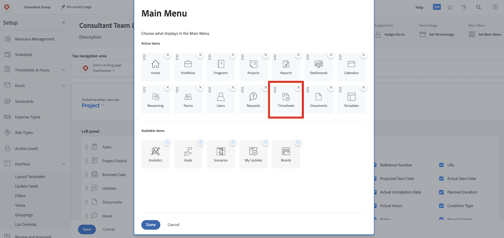

# Vad är layoutmallar?

Workfront har massor av bra verktyg som hjälper dig att få jobbet gjort. Men för mycket av en bra sak kan vara överväldigande.

Med layoutmallar kan systemadministratörer och gruppadministratörer anpassa användarens upplevelse och låta dessa användare fokusera på det som är viktigt för dem.

Större delen av organisationen loggar till exempel inte tid. Konsultteamet fakturerar dock kunderna, så de måste logga tid för att säkerställa korrekt fakturering. Med en layoutmall kan tidrapporter döljas för dem som inte behöver dem och visas för dem som gör det.

## Innan du bygger

Workfront rekommenderar att du pratar med användarna innan du skapar en layoutmall. Att involvera dem som ska använda layoutmallen, t.ex. gruppadministratörer, kommer att göra det mycket enklare att placera rätt information och verktyg framför rätt personer.

Och var inte rädd för att göra ändringar efter att en mall har skapats. Fortsätt att få feedback om vad de behöver och vill se och få tillgång till. Kom ihåg att layoutmallar är avsedda att skapa en ren och enkel upplevelse för användarna.
