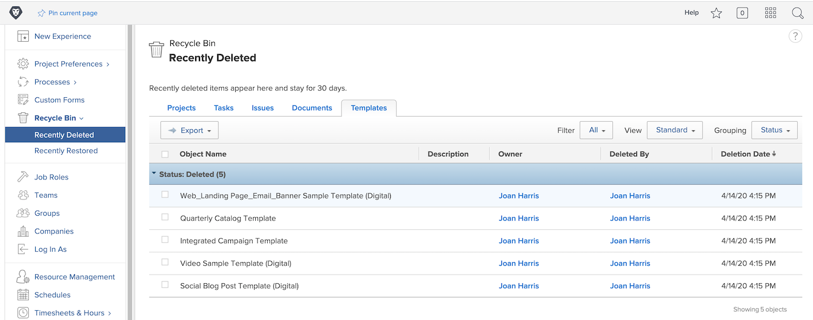

# Återställ objekt från papperskorgen

Projektarbetet förändras på många olika sätt. Du kan ta bort något, bara för att 30 minuter senare inse att uppgiften behövdes eller att dokumentet var viktigt för det problem du försöker lösa.

När objektet tas bort placerar Workfront det i papperskorgen i upp till 30 dagar. Systemadministratören kan återställa objektet till dess ursprungliga position i Workfront, tillsammans med all information (uppdateringar, loggade timmar, dokument osv.).

## Återställa ett objekt

1. Välj området **Inställningar** i **Huvudmenyn**.
1. Klicka på **Papperskorgen** i den vänstra panelen.
1. Välj **Nyligen borttagen**.

Varje återställningsbart objekt har en flik som gör det enklare att hitta det objekt som ska återställas.

1. Klicka på objektets flik.
1. Markera rutan intill objekt som ska återställas.
1. Klicka på knappen **Återställ**.

Objektet/objekten som återställs visas kort i ett [!UICONTROL Pågår] -avsnitt. När skärmen uppdateras visas inte längre objekten på skärmen eftersom de har återställts. Objekten visas där de tidigare fanns i [!DNL Workfront], som du kan verifiera på skärmen [!UICONTROL Senast återställda].

Gruppadministratörer kan återställa ett projekt som är associerat med gruppen de hanterar, tillsammans med uppgifter, problem eller dokument som är kopplade till projektet.

<!---
learn more URL
Restoring deleted items
Viewing items that have been recently restored
--->
