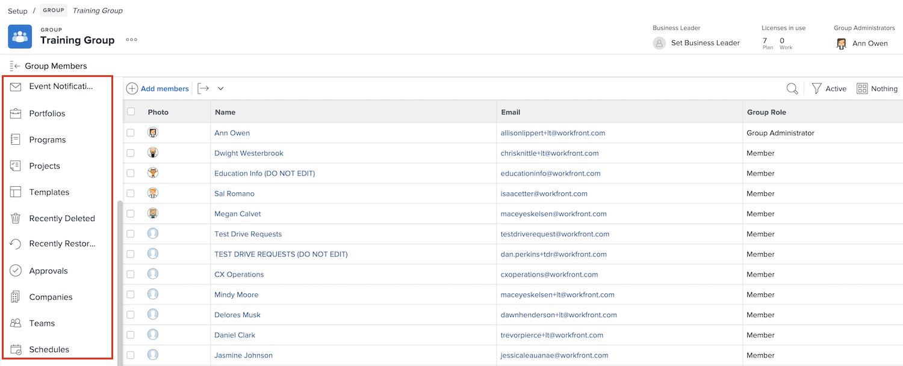

# Förstå behovet av gruppadministratörer

<!---
21.4 updates have been made
--->

När du är systemadministratör för ett stort företag eller ett företag med många [!DNL Workfront] användare kan det ta lång tid att behålla [!DNL Workfront]-inställningarna för varje grupp och undergrupp.

Att utse gruppadministratörer som kan utföra vissa administrativa funktioner för sina egna grupper i [!DNL Workfront] hjälper till att balansera belastningen när det gäller att uppdatera och underhålla systemet.

Gruppadministratörer är ofta mer anpassade till gruppens dagliga utmaningar, så att de kan hantera gruppens behov. På så sätt kan du som systemadministratör fokusera på de [!DNL Workfront]-konfigurationer som passar din organisation som helhet.

Några av de saker som gruppadministratörer kan göra i [!DNL Workfront] är:

* Skapa undergrupper och lägg till användare i undergrupperna.
* Skapa layoutmallar för gruppen.
* Skapa godkännandeprocesser för gruppen.
* Skapa arbetsflödesstatus på gruppnivå.
* Få åtkomst till projekt, program och portföljer som är kopplade till gruppen från gruppsidan.
* Hantera inställningar för projekt, uppgifter och utgåvor på gruppnivå.
* Hantera tidrapportinställningar på gruppnivå.
* Hantera händelsemeddelanden på gruppnivå.
* Logga in som andra gruppmedlemmar.
* Tilldela en företagsledare till gruppen.
* Hantera ett företag.

Som system- eller gruppadministratör kan du skapa undergrupper inom de grupper och undergrupper som du administrerar. Dessa undergrupper kan tilldelas egna gruppadministratörer.

>[!NOTE]
>
>Det finns en gräns på 14 nivåer av undergrupper under en grupp.

**Läs mer om gruppadministratörer**

<!---
bullet points below need hyperlinks
--->

En lista över vilka systemadministratörer, gruppadministratörer och undergruppadministratörer kan göra i [!DNL Workfront] finns i artikeln Åtgärder som tillåts för olika typer av administratörer.

## Hantera en grupp

Hantera snabbt och effektivt gruppmedlemmar, undergrupper, gruppstatus, gruppprojektinställningar med mera från gruppsidan i [!DNL Workfront].

1. Välj **[!UICONTROL Konfigurera]** på **[!UICONTROL huvudmenyn]**.
1. Gå till **[!UICONTROL Grupper]** i den vänstra panelen.
1. Markera namnet på en grupp som du vill öppna.
1. Öppna det avsnitt som du vill göra uppdateringar i genom att klicka på det i den vänstra panelen.

<!---
learn more URLs
Create and manage groups 
Create and manage subgroups 
Business leader overview 
--->
