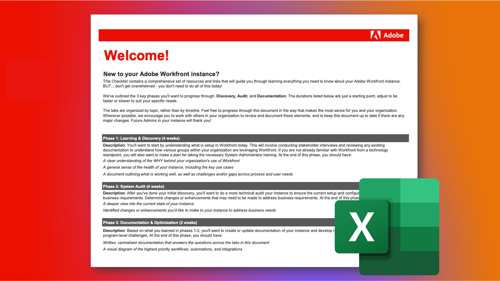

# Ta hand om en befintlig Adobe Workfront-instans

Det underbara med Workfront är att det är så anpassningsbart. Utmaningen med Workfront är att det är så anpassningsbart. Och om du är ett nytt system, eller en ny grupp, som administratör tar över en befintlig Workfront-instans, kan det vara överväldigande att se hur den ursprungligen konfigurerades och konfigurerades.

Men via vår lista Inherited Instance Checklist kan du lära dig allt du behöver veta om din instans.\
 
 
<a href="assets/adobe-workfront-system-admin-playbook-inherited-instance.xlsx" class="spectrum-Button spectrum-Button--outline spectrum-Button--primary spectrum-Button--sizeM">
Hämta checklistan för ärvda instanser 
</a>

I den här checklistan ska du granska en omfattande uppsättning frågor, resurser och länkar för att få en tydlig förståelse för hur den har konfigurerats.

Dessutom har vi skisserat tre viktiga faser som du ska gå igenom - Discovery, Audit, and Documentation - med föreslagna varaktigheter. Dessa kan justeras efter dina specifika behov och behöver inte göras allt på ett och samma ställe!

Flikarna i kalkylbladet är ordnade efter ämne, i stället för efter tidslinje, så att du kan gå igenom dokumentet på det sätt som passar dig och din organisation bäst.

Där det är möjligt rekommenderar vi att du samarbetar med andra i din organisation för att granska och dokumentera dessa element, och att du håller dokumentet uppdaterat om det finns några större förändringar. Framtida administratörer kommer att tacka dig!

 
 

## Fas 1: Utbildning och identifiering

<b>Föreslagen tidsram: 4 veckor</b>

Det första du behöver göra är att förstå hur din instans av Workfront är konfigurerad idag.

Detta innebär att genomföra intervjuer med intressenter och granska all befintlig dokumentation för att förstå hur olika grupper inom organisationen utnyttjar Workfront.

Om du inte är bekant med Workfront ur teknisk synpunkt kan du ta utbildning i systemadministratör. Detta ger nödvändig insikt i hur olika inställningar fungerar och påverkar varje verktyg, och eventuellt varje användare, i Workfront.

I slutet av den här fasen bör du ha:

* En tydlig förståelse för VILKET som ligger bakom er organisations användning av Workfront

* En allmän känsla för instansens hälsa, inklusive viktiga användningsfall

* Ett dokument som beskriver vad som fungerar bra, samt utmaningar och/eller luckor mellan process- och användarbehov
 
 

## Fas 2: Systemgranskning

<b>Föreslagen tidsram: 4 veckor </b>

Efter den första identifieringen rekommenderar vi att du gör en mer teknisk granskning av din instans. Det innebär att du måste fastställa ändringar eller förbättringar som kan behöva göras för att din nuvarande konfiguration och konfiguration ska uppfylla dina verksamhetskrav och behov.

I slutet av den här fasen bör du ha:

* En djupare vy av instansens aktuella tillstånd

* Identifierade ändringar eller förbättringar som du vill göra i instansen för att tillgodose företagets behov.
 
 

## Fas 3: Dokumentation och optimering

<b>Föreslagen tidsram: Inledande = 2 veckor; Kontinuerlig uppdatering </b>

Baserat på vad du lärt dig i faserna 1 och 2 vill du skapa, uppdatera och dokumentera din instans och utveckla färdplaner för strategiska utmaningar och utmaningar på programnivå.

Denna fas pågår, men du bör ha:

* Skriven centraliserad dokumentation som besvarar frågor på alla flikar i det här dokumentet

* Ett visuellt diagram över arbetsflöden, automatisering och integreringar med högsta prioritet

* Eftersläpning eller färdplan som dokumenterar framtida förbättringar för att förbättra organisatoriska och strategiska utmaningar

 
Genom att gå igenom varje fas, och med hjälp av checklistan för den ärvda instansen, bör du som ny system- eller gruppadministratör få en bättre förståelse för hur din Workfront-instans är konfigurerad, vilka justeringar eller förbättringar som behöver göras och sammanställa dokumentationen för att optimera organisationens Workfront-upplevelse.

 
 

Ytterligare information finns nedan:
* [Definiera mål för implementeringen av Workfront](https://experienceleague.adobe.com/docs/workfront/using/administration-and-setup/get-started-administration/define-wf-goals-objectives.html?lang=en)
* [Blogginlägg: Ledarskap och värde för ledarskap](https://experienceleaguecommunities.adobe.com/t5/workfront-blogs/customer-success-tips-executive-sponsorship-and-value-to/ba-p/518353)
* [Blogginlägg: Introduktion till Adobe Workfront KPI:er](https://experienceleaguecommunities.adobe.com/t5/workfront-blogs/kpi-dashboards-in-the-new-workfront-experience-introduction-to/ba-p/549001)
