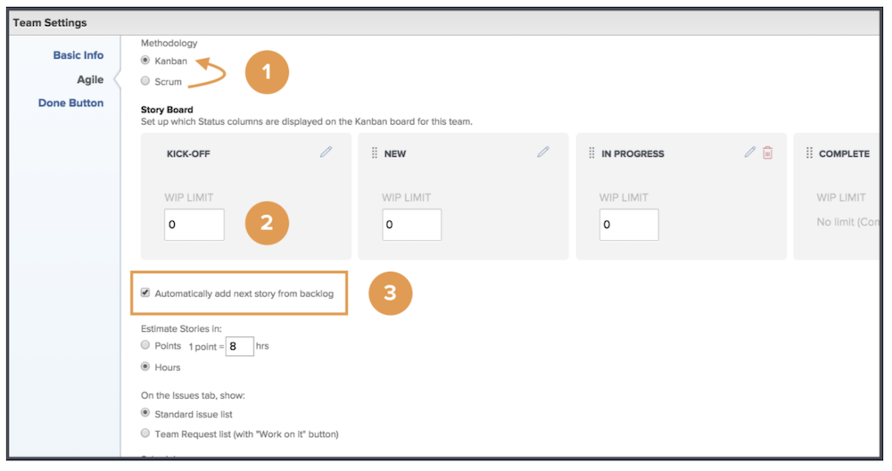
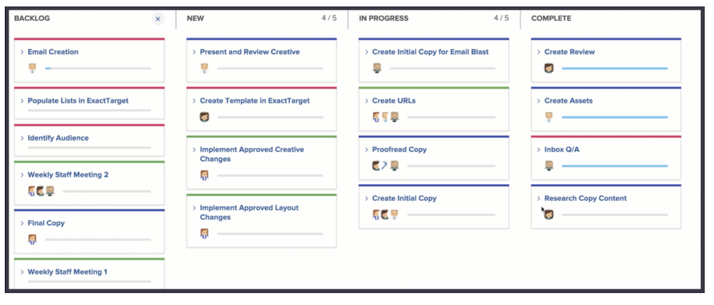

# Skapa ett kanban-team

Creative Marketing Team har använt Scrum ett tag nu. De uppskattar den flexibla miljön i ett smidigt team, men de tycker att det är svårt att genomföra berättelser inom en viss tidsram på grund av hur ofta prioriteringarna ändras för teamet.

De har ett alternativ till Scrum. Det kallas Kanban.

Kanban fungerar för team som inte vill definiera vad de arbetar med inom den tidsram som en Scrum-baserad iteration kräver. I stället tillåter Kanban att team arbetar kontinuerligt genom sin eftersläpning.

Låt oss växla Creative Marketing Team från ett Scrum-team till ett Kanban-team [1]. Gör den här ändringen i sektionen Agile i gruppinställningarna.

När du har ändrat metoden måste du ange hur många artiklar ett Kanban-team kan ha i taget i varje kolumn genom att justera&quot;PIA-gränsen&quot;. [2]. PIA står för Work in Progress. Antalet du väljer att placera här beror på hur många aktiva objekt teamet kan hantera. Det visas i teamets storyboard för att hjälpa till att påminna dem om de är överallokerade eller inte. Du (och alla medlemmar i teamet som har redigeringsbehörighet) kan också ändra PIA-gränsen direkt från storyboard.

Lägg märke till att du kan dra och släppa statuskolumner för att placera dem i den ordning som du vill att de ska vara i.

Kanban-team kan också välja att nästa artikel i eftersläpningen automatiskt ska visas i storyboard när en artikel är klar [se nummer 3 i den översta bilden]. Detta kommer att hjälpa team som föredrar en kontinuerlig arbetscykel.

Bilden nedan visar hur den ser ut när en ny artikel automatiskt visas på storyboard när artikeln är klar.

För effektivare hantering av det färdiga arbetet finns artiklarna som standard i 14 dagar.

Om det behövs kan den inställningen justeras till mellan 1 och 30 dagar i teaminställningsfönstret.

Tänk på att även om det här är en annan metod är det fortfarande viktigt när du arbetar i en flexibel miljö att hela tiden leta upp eftersläpningen genom att diskutera artikelbehov och justera artikelprioritet. När du vill prioritera om eftersläpningen måste du flytta en flik till fliken Eftersläpning för att kunna ordna om den.
