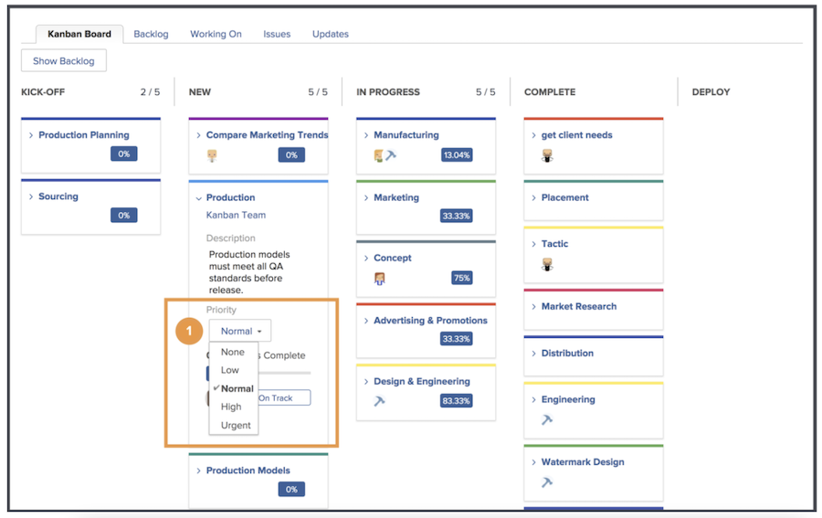

# Hantera arbetet som ett Kanban-team

Hantera arbetet som ett Kanban-team Lägg till artiklar i kanban-eftersläpningen Det finns flera sätt att lägga till artiklar i Creative Marketing teams eftersläpning.

Teamet kan lägga till artiklar direkt från sin eftersläpning.
De kan även tilldelas uppgifter i ett projekt. Om Creative Marketing-teamet har dirigerade förfrågningar visas de på teamets begärandeflik. Dessa visas i teamets eftersläpning om teamet väljer begäran och konverterar den till en artikel.

## Använda Kanban-tavlan

När du har prioriterat artiklar i eftersläpningen är det dags att gå över till Kanban-styrelsen. Du kan göra uppdrag genom att dra och släppa skiljetecknen för de teammedlemmar som ska arbeta med artikeln på artikelkortet.

När vi går vidare kommer teamet att flytta dem till rätt status i storyboard. Teammedlemmar kan använda kanban-flaggorna för att ange om en artikel är On Track, Blocked eller Ready to Pull. Detta kommunicerar med andra teammedlemmar vilka arbetsobjekt som är på gång och om de är klara att bearbetas eller inte.

Teammedlemmar kan även uppdatera korten direkt i storyboard för att återspegla förändringar i exempelvis beskrivning, status eller prioritet. De gör detta genom att klicka på listrutemenyn på ett artikelkort och göra sina ändringar i rätt fält [1].

## Kanban-artikelkörning

Observera att du använder en pågående arbetsbegränsning på fem artiklar. När du tittar på din styrelse ser du att när du flyttar uppgifter till statuskolumner visas antalet uppgifter i varje ruta överst till höger i varje statuskolumn.

Om du överskrider gränsen i en statuskolumn som är lika med Nytt eller Pågår visas ett felmeddelande som anger att du har överskridit gränsen för pågående arbete.

Om ditt team beslutar att de kan hantera fler eller färre objekt samtidigt kan du (och andra teammedlemmar med redigeringsbehörighet) ändra antalet pågående arbeten direkt från storyboard genom att klicka på Pågående arbete-numret och redigera det så att det återspeglar ditt nya beslut.
