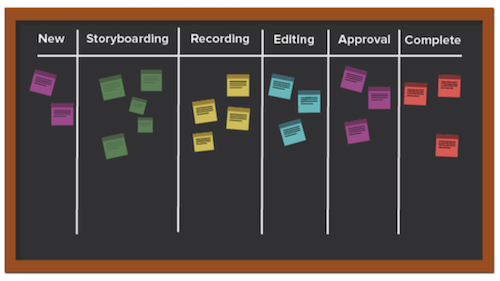

# Vad är Kanban-metoden och hur fungerar den?

Till skillnad från andra flexibla metoder som fokuserar på en cyklisk process fokuserar Kanban-metoden på ett optimerat arbetsflöde. Kanban vill förbättra arbetsflödet genom att visualisera arbetet med en Kanban-panel, ange en gräns för mängden arbete som kan utföras och analysera flödet för att göra kontinuerliga förbättringar.

Låt oss titta på några av huvudelementen i Kanban.

## Nyckelspelare

Nyckelspelarna i ett Kanban-team liknar de i ett Scrum-team, förutom att det inte finns någon Scrum master. Det kan fortfarande vara vettigt för någon att agera som projektledare eller ansvarig, men teoretiskt sett bör denna roll finnas när behovet uppstår.

## Visualisering: Kanban-tavla

Det finns många sätt att formatera din Kanban-tavla. Team har en styrelse som kan ha ett obegränsat antal kolumner. Varje kolumn representerar statusen för det arbete som utförs.

På den enklaste ritytan kan den första kolumnen vara&quot;att göra&quot;, den andra&quot;pågående&quot; och den tredje&quot;fullständiga&quot;.

Många företag har sin egen terminologi för kolumnnamnen, eller de kan till och med lista ut varje steg i en process, men avsikten är densamma. Teammedlemmar flyttar sina artiklar från kolumn till kolumn beroende på vilket läge arbetet befinner sig i.

## Prioritering

Teammedlemmar arbetar med en produktchef eller projektledare för att säkerställa att artiklarna i eftersläpningen och andra statuskolumner prioriteras och att arbetet fortsätter att gå mot slutförande. Produkthanteraren ansvarar fortfarande för att se till att kundens röst hörs och att produkten går i rätt riktning.

## Begränsa pågående arbete

En unik aspekt av Kanban är att teamen har en begränsning av sin kapacitet för hur många berättelser de kan hantera vid en given tidpunkt. Teamen väljer en viss mängd artiklar som de är villiga att ha i sina&quot;att göra&quot;- och&quot;pågående&quot;-kolumner, och de går inte igenom den siffran för att förhindra utbränning. När en artikel har flyttats till&quot;fullständig&quot; ersätts en artikel från eftersläpningen i kolumnen&quot;att göra&quot;.

## Kontinuerlig förbättring

Kanban möjliggör kontinuerlig förbättring genom att tillhandahålla ett system för att mäta deras effektivitet. De kan tydligt se hur deras arbetsflöden fungerar, hur lång tid varje del av arbetsflödet tar och hur ofta deras produkter kommer ut i tid. Det gör det enklare att experimentera med olika sätt att optimera utdata.
