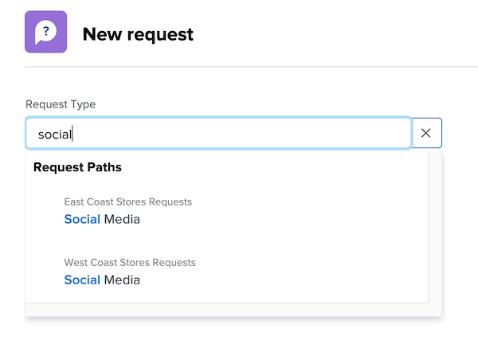

# Gör en förfrågan

I den här videon får du lära dig att:

* Navigera till begärandeområdet
* Gör en förfrågan
* Visa skickade begäranden
* Hitta ett utkast till en begäran

>[!VIDEO](https://video.tv.adobe.com/v/336092/?quality=12)

## Hitta kösökvägarna snabbt och enkelt

När du klickar på [!UICONTROL Typ av begäran] de tre senaste begärandesökvägarna som du nyligen skickade visas automatiskt högst upp i listan. Välj ett alternativ för att arkivera en annan begäran i samma kö.

Längst ned i listan finns alla begärandeköer som du har åtkomst till. Om du är osäker på vilken kö du ska använda för din begäran kan du använda nyckelordssökningen för att snabbt och enkelt hitta den du behöver.

När du skriver nyckelord [!DNL Workfront] öppnar matchningar så att du kan hitta den kösökväg som passar dina behov. Om du till exempel vill göra en begäran om ett inlägg i sociala medier börjar du skriva&quot;sociala medier&quot; i [!UICONTROL Typ av begäran] och listan uppdateras dynamiskt för att visa eventuella träffar.

Välj önskat alternativ, fyll i formuläret och skicka begäran.

<!---
Learn more
Requests area overview
Create and submit Workfront requests
Guides
Make a work request
--->
