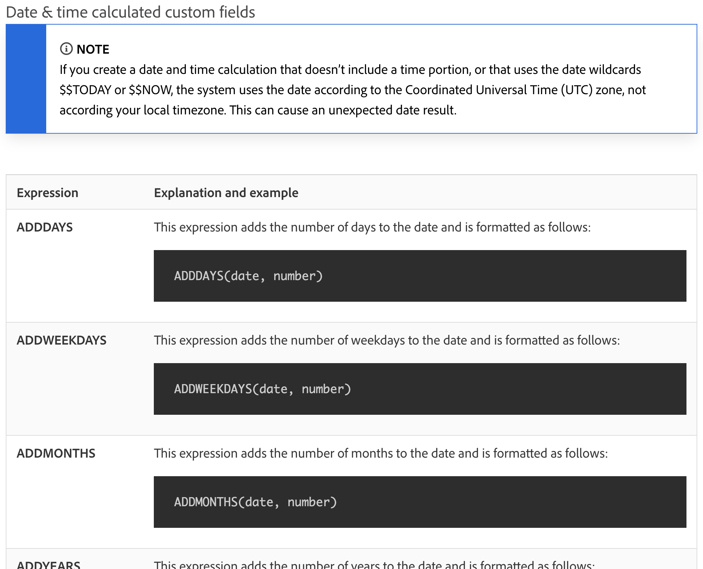
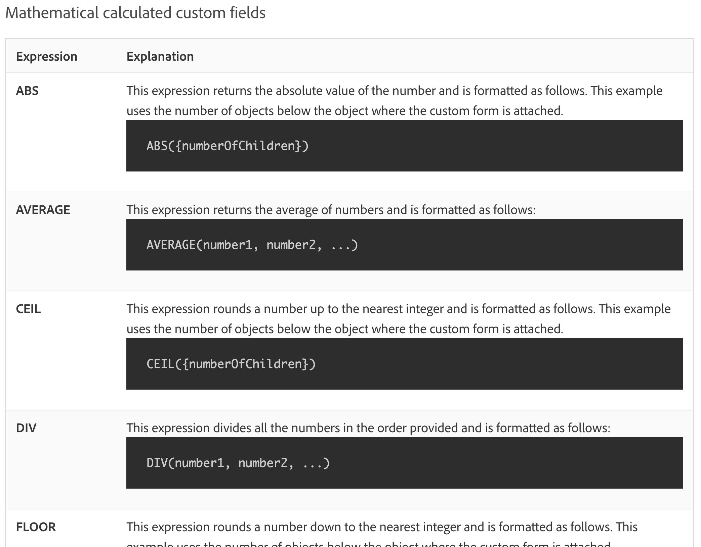

# Förstå datum- och tidsuttryck och matematiska uttryck

## Datum- och tidsuttryck

Med datum- och tidsuttryck kan du placera viktiga datum längst fram i dina rapporter, automatiskt beräkna hur många arbetsdagar det tog att slutföra en uppgift eller ta bort tidsstämplar från vyn när de inte behövs.

När du tittar på tillgängliga datum- och tidsuttryck hittar du flera alternativ.

Det finns två datum- och tidsuttrycksuppsättningar som används oftast av [!DNL Workfront] kunder:

* ADDDAYS/ADDWEEKDAY/ADDMONTHS/ADDYEARS OCH
* DATEDIFF / VECKDAYDIFF

## Matematiska uttryck

Matematiska uttryck tillåter [!DNL Workfront] att automatiskt utföra beräkningar, oavsett om de är enkla eller komplicerade.

När du tittar på tillgängliga datum- och tidsuttryck kommer du att se att det finns flera tillgängliga alternativ.

Workfront-kunder använder vanligtvis dessa två matematiska uttrycksuppsättningar:

* SUB, SUM, DIV, PROD
* ROUND

<b>ANMÄRKNING</b>: En fullständig lista över uttryck och mer information om vart och ett finns på dokumentationssidan &quot;Calculated data expressions&quot;.