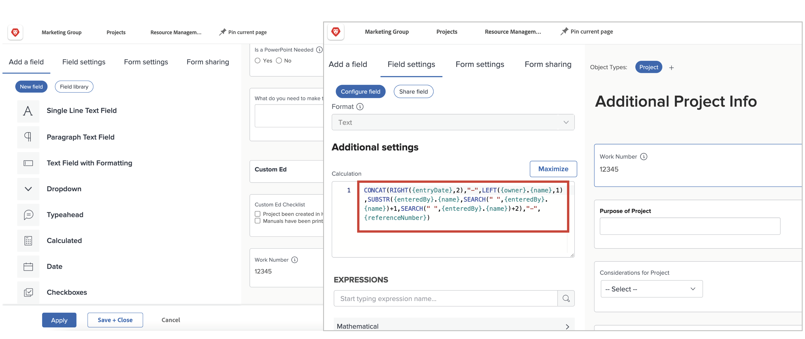

# Kom igång med beräkningsfält och uttryck

<!-- **Note**: The expression examples shown are simple and some may be mitigated by fields already supplied by  . However, the examples are used to illustrate the foundational knowledge needed in order to build expressions in Workfront.-->

Workfront har ett antal områden som är gemensamma för flera olika affärsområden och som ofta används för att hantera arbetet. Fält som planerat slutförandedatum, projektbudget, namn på tilldelad uppgift osv.

Men varje organisation har data som är specifika för dess bransch och företag som behöver samlas in för att förstå om företagets mål uppfylls. Din organisation vill till exempel hålla reda på:

* Vilken typ av verksamhet ett projekt ska bidra till.
* Om finansiering kommer från leverantörer, interna eller båda.
* Vilken upplösning som behövs för de bilder som används.

Även om dessa fält inte är inbyggda i [!DNL Workfront] kan du skapa anpassade datainmatningsfält och förifyllda flervalssvarsfält via ett anpassat formulär.

Denna inlärningsväg fokuserar på beräkningsfältet. Du får lära dig vad ett beräkningsfält är, de olika typer av information som du kan hämta in i beräkningsfältet med hjälp av datauttryck och hur du skapar dessa beräkningsfält för att förbättra din datainsamling och rapportering.

## Vad är ett beräknat fält?

Ett beräkningsfält innehåller anpassade data som har skapats med datauttryck och befintliga Workfront-fält.

Organisationen har till exempel ett specifikt projekttonummer, eller ett arbetsnummer, som innehåller:

* År då projektet skapades,
* Initialer från projektägaren, och
* Projektreferensnumret [!DNL Workfront].

Med uttryck i ett beräkningsfält kan du ta varje informationsdel som redan lagrats i [!DNL Workfront] och skapa det unika projekt-ID:t, eller arbetsnumret, som sedan kan läggas till i en rapport som den här:

Beroende på vilka data som behövs kan beräkningsfält vara enkla, använda ett eller två uttryck, eller mer komplicerade, med flera inbäddade uttryck. Kom ihåg att Workfront bara kan använda data som redan är lagrade eller hämtade i systemet för beräkningsfält.

## Textuttryck

Textuttryck söker efter, dissekerar och kombinerar information som finns i [!DNL Workfront] för att skapa mer meningsfulla data eller få bättre insikt i det arbete som utförs i organisationen.

Textuttryck kan till exempel användas för att:

* Visa&quot;Över 5 000 dollar&quot; när projektutgifterna är större än 5 000 dollar, eller&quot;Under 5 000 dollar&quot; när utgifterna är lägre än så, i en kolumn i en projektvy.

* Ge varje projekt ett unikt nummer som innehåller det år då projektet skapades, projektets [!DNL Workfront]-referensnummer, projektets namn och projektets ägare.

* Skapa en rapport som visar alla projekt som inte har tilldelats en portfölj och/eller ett program så att du kan använda den i dina chefsmöten.

Textuttryck kan användas i ett anpassat fält för att göra den här typen av sökningar och kombinationer i Workfront.

När du tittar på de möjliga textuttrycken finns det flera alternativ.

Det finns sex textuttryck som används oftast:

* KONKAT
* VÄNSTER/HÖGER
* INNEHÅLLER
* IF
* ISBLANK