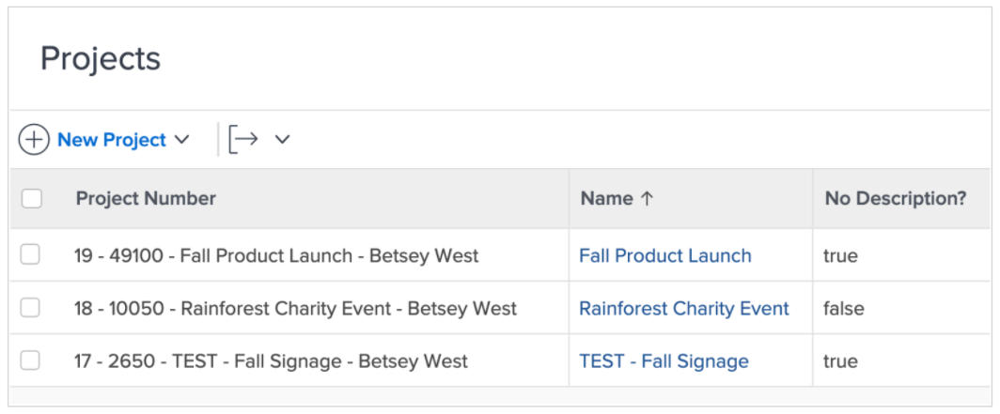
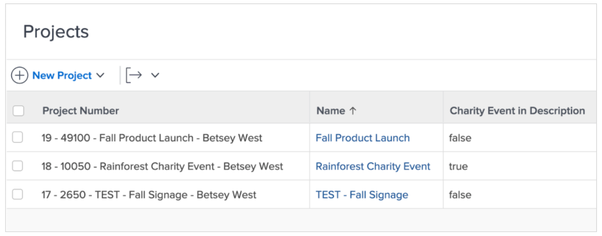
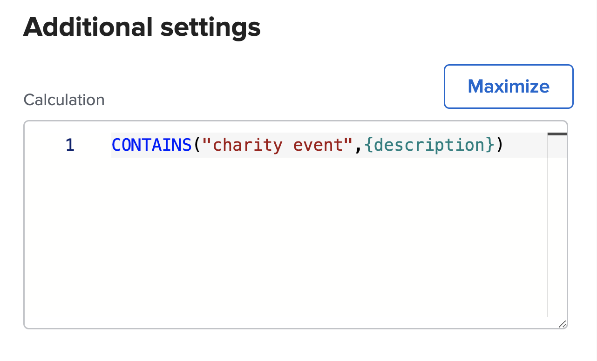

# Använd uttrycken ISBLANK och CONTAINS

Både CONTAINS- och ISBLANK-uttrycken används för att ge enkla true- eller false-värden. Skillnaden är att ISBLANK-uttrycket kontrollerar om fältet innehåller ett värde alls medan CONTAINS-textuttrycket söker efter en viss sträng i ett fält.

Om du till exempel vill se om ett projekt har en beskrivning använder du uttrycket ISBLANK. Om beskrivningsfältet är tomt returnerar uttrycket värdet true. Om beskrivningsfältet inte är tomt returneras värdet false.

Om du vill söka efter ett specifikt värde i beskrivningen, t.ex.&quot;välgörenhetshändelse&quot;, använder du textuttrycket CONTAINS. Om det finns en&quot;välgörenhetshändelse&quot; i beskrivningen, anges&quot;true&quot; i beräkningsfältet. &quot;false&quot; visas om det inte finns någon &quot;välgörenhetshändelse&quot;.

## ISBLANK

Textuttrycket ISBLANK innehåller namnet på uttrycket och en datapunkt.

**ISBLANK({datapunkt})**

I exemplet ovan, där du vill veta om projektet har en beskrivning, skulle uttrycket vara:

ISBLANK({description})

## INNEHÅLLER

I CONTAINS-textuttrycket ingår namnet på uttrycket, ordet eller frasen som du söker efter och fältet som ska sökas in.

**CONTAINS(&quot;fras&quot;,{fields})**

Se till att placera citattecken runt ordet eller frasen du söker efter, annars är uttrycket inte giltigt.

I exemplet ovan (söker efter&quot;välgörenhetshändelse&quot; i projektbeskrivningen) skulle uttrycket vara:

**CONTAINS(&quot;välgörenhetshändelse&quot;),{description})**

**Anteckning**: CONTAINS-uttrycket är skiftlägeskänsligt. Om&quot;välgörenhetshändelse&quot; till exempel har inledande versal i beskrivningsfältet, ska frasen ha inledande versal i uttrycket.

**CONTAINS(&quot;välgörenhetshändelse&quot;),{description})**

Uttrycken ISBLANK och CONTAINS är bra att använda om du vill se om det finns ett värde. Det kan dock vara mer användbart att veta vad värdet är, att faktiskt se det eller att ha någon typ av beskrivning för att få bättre insikt.

I stället för att bara veta att ett projekt har konverterats från en begäran vill du till exempel veta namnet på den ursprungliga begäran.

I så fall använder du CONTAINS-uttrycket tillsammans med ett IF-uttryck.

Oftast används textuttrycken ISBLANK och CONTAINS med ett IF-textuttryck.
