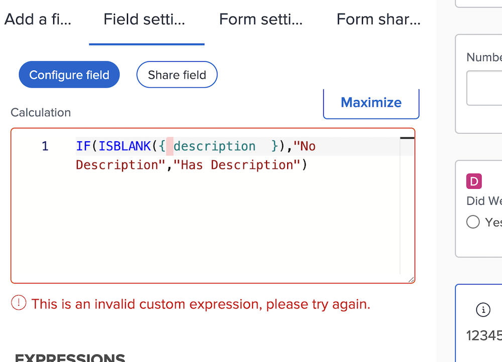

# Saker att känna till om beräknade fältuttryck

Här är en lista med koncept som är bra att känna till när du arbetar med anpassade beräkningsfält i Workfront.

## Områden i uttrycksnamn botas

När det gäller uttrycksnamn är det viktigt med bockning. När du skriver ett uttrycksnamn kan du använda versaler, gemener eller en blandning av båda.

Uttrycket måste dock skrivas som versaler för att uttrycket ska identifieras och fältet sparas.

## Timmar sparas i minuter

Timmar i Workfront-databasen lagras på några minuter. Om du refererar till fält som Planerade timmar eller Faktiska timmar, dividerar du med 60 för att visa tiden i timmar och inte minuter.

## Avstånd påverkar inte uttryck

Det rekommenderade sättet att skriva uttryck är att ha lite eller inget mellanrum mellan varje uttryck.

* IF(ISBLANK({description}),&quot;Ingen beskrivning&quot;,&quot;Har beskrivning&quot;)

Om du vill se vad som pågår med mellanrum kan vissa mellanrum läggas till i uttrycken. Det extra utrymmet bör inte hindra uttrycket från att samla in eller beräkna ett värde i [!DNL Workfront].

* IF (ÄRBLANK ({description}), &quot;Ingen beskrivning&quot;, &quot;Har beskrivning&quot;)

Det enda som inte kan ha blanksteg mellan dem är fälten och klamrarna. Annars får du ett felmeddelande och kan inte spara fältet eller det anpassade formuläret.

## Citattecken måste vara raka

När du använder citattecken i ett uttryck måste du se till att citattecknen är raka (&quot;). Om citattecknen är böjda (&quot;) kommer systemet [!DNL Workfront] att fortsätta visa meddelandet&quot;Ogiltigt anpassat uttryck&quot;.

## Beräkningar uppdateras när formulär sparas och objekt redigeras

Detta är en viktig aspekt av beräkningsfält som ska tolkas.

Information som visas i ett beräkningsfält förblir densamma och blir gammal om inte det anpassade formuläret beräknas om.

Uttryck kan uppdateras med alternativet Beräkna om uttryck på menyn Mer på ett objekt.

Du vill se hur många dagar ett problem har varit öppet. Skapa ett beräkningsfält med namnet&quot;Days Open&quot; med uttrycket DATEDIFF.

* Fältnamn = Öppnade dagar
* Uttryck = DATEDIFF({entryDate},$$TODAY)

När du har sparat dokumentet kan du se antalet dagar mellan när utgåvan skapades eller skrevs in i Workfront och dagens datum på informationssidan för ett objekt eller i en rapportvy.

När du visar samma informationssida eller rapportvy nästa dag förväntar du att det numret ska ökas med ett. Om siffran är 5 idag, borde den vara 6 imorgon. Nästa dag ska vara 7, 8 osv.

Fältet kommer dock att visas 5 varje dag. Fältet måste köras igen eller beräknas om för att informationen ska uppdateras.

Så här uppdaterar du ett fält med alternativet Beräkna om uttryck:

* Klicka på objektets namn för att öppna det.
* Klicka på menyn Mer.
* Välj Beräkna om uttryck i listan.

Du kan också beräkna om flera uttryck samtidigt genom att använda funktionen&quot;massredigering&quot; i en lista eller rapport. Anta att du har skapat en rapport som visar en lista med problem med beräkningen Öppna dagar i en kolumn. Om du vill beräkna om alla utgåvor samtidigt:

* Markera alla problem i rapporten.
* Välj redigeringsalternativet om du vill redigera alla markerade utgåvor gruppvis.
* Klicka på etiketten Anpassad Forms till vänster för att rulla ned till avsnittet Anpassade formulär.
* Markera rutan Beräkna om anpassade uttryck längst ned i avsnittet Anpassad Forms.
* Klicka på Spara ändringar.

Skärmen uppdateras för att visa uppdaterad information i beräkningsfältet.

**Obs!** Även om det finns andra sätt att uppdatera, eller beräkna om, uttryck i ett beräkningsfält, är detta det snabbaste och enklaste sättet.

## Beräkningar kan variera från formulär till formulär i samma fält

När ett beräkningsfält sparas i ett anpassat formulär och det anpassade formuläret sparas, läggs beräkningsfältet till i fältbiblioteket så att det kan användas i andra anpassade formulär.

Om du har ett beräkningsfält på formulär A och samma beräkningsfält på formulär B, är den första tanken att beräkningarna är exakt likadana. Så är inte alltid fallet. Det beräknade fältet i formulär A skulle kunna vara en helt annan metod för formulär B.

När ett beräknat anpassat fält väljs från fältbiblioteket och läggs till i ett anpassat formulär, läggs fältet till men beräkningen är tom. En orsak till detta är att beräkningen kan referera till fält som inte finns för en annan objekttyp.

Du har till exempel skapat ett beräkningsfält,&quot;Dagar att slutföra&quot;, som avgör hur lång tid det tog att slutföra en uppgift i ett projekt.

* VECKODAYDIFF({actualStartDate},{actualCompletionDate})

Du vill göra samma sak för en iteration. Du kan använda samma uttryck, men fälten som är tillgängliga för ett åtgärdsobjekt är inte alltid tillgängliga för ett upprepningsobjekt. [!DNL Workfront] ger dig alltså möjlighet att skapa beräkningen med rätt objektfält.

**Pro-Tip**: Kopiera det beräknade uttrycket från rutan Beräkning till fältet Instruktioner när du skapar anpassade fält. Det här fältet raderas inte när ett beräknat anpassat fält läggs till i det anpassade formuläret från fältbiblioteket.

Beroende på behov kan beräkningsfält i anpassade formulär vara ganska enkla eller mycket komplexa. Uttryck kan bädda in, eller kapsla in, andra uttryck och värden för att ge den detaljnivå som behövs för att få en bättre bild av vad som pågår i arbetet i organisationen.

<!--Depending on the need, calculated fields in custom forms can be quite simple or very complex. Expressions can embed, or nest, other expressions and values to provide the level of detail needed to get a better picture of what is going on with the work being done at your organization. 

Most of the examples and exercises in this course have been relatively simple to provide a base understanding of the expressions most commonly used and how to build those expressions in a custom calculated field. 

Now you're ready to start building your own calculated custom fields.-->
