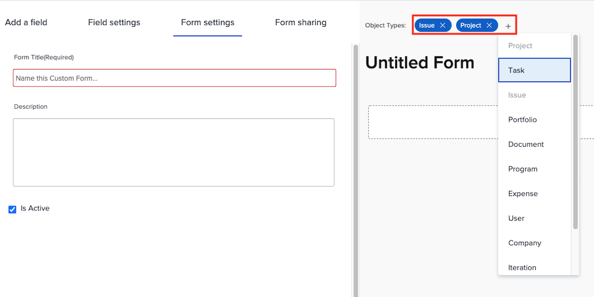

# Skapa och dela ett anpassat formulär

I den här videon får du lära dig att:

* Bestäm vilka objekt som ska användas i formuläret
* Lägg in unika fält i en mängd olika format
* Ordna fält med hjälp av avsnitt och logik
* Dela formulär med andra användare

>[!VIDEO](https://video.tv.adobe.com/v/335172/?quality=12)

## Anpassade formulär fungerar med flera objekttyper

När du klickar på [!UICONTROL Nytt anpassat formulär] kan du markera så många objekt som du vill använda med ett anpassat formulär. Alla fält som du lägger till i det här formuläret är tillgängliga för alla markerade objekt när det anpassade formuläret bifogas till dem.

![Eget formulärfönster med [!UICONTROL Nytt anpassat formulär] objektalternativ](assets/create-custom-form.png)

När du redigerar ett anpassat formulär kan du se alla markerade objekttyper. Du kan lägga till eller ta bort objekttyper från den här listan.

Du kanske vill skapa en anpassad typ av projekt och utgåva. När du bifogar en utgåva kan du fylla i alla fält som hör till utgåvan. Om du senare bestämmer dig för att konvertera utgåvan till ett projekt, läses det anpassade formuläret in automatiskt till projektet och de data du placerar i fälten i det anpassade formuläret blir tillgängliga för visning eller redigering i det anpassade projektformuläret.

## Alternativ för anpassade fält

**[!UICONTROL Etikett] och [!UICONTROL Namn] fält**

The [!UICONTROL Etikett] och [!UICONTROL Namn] fält i ett anpassat fält har olika syften. [!UICONTROL Etikett] är fältnamnet som användarna kommer att se i [!DNL Workfront]. [!UICONTROL Namn] är vad som kan användas med integreringar, t.ex. API.

![Eget formulärfönster [!UICONTROL Etikett] och [!UICONTROL Namn] fält](assets/custom-forms-field-label-and-name.png)

Det ger flexibilitet att ändra användartillvända etiketter så att de matchar ändringar i organisationen, utan att det påverkar integreringar eller andra anslutningar som är beroende av ett specifikt fältnamn.

**[!UICONTROL Textfält med formatering]**

The [!UICONTROL Textfält med formatering ]innehåller grundläggande textmarkeringsverktyg som gör att användare kan lägga till fet, kursiv eller understrykning i text när de fyller i fältet i ett anpassat formulär.

![Eget formulärfönster [!UICONTROL Textfält med formatering] option](assets/custom-forms-text-field-with-formatting.png)

Fältet har också en gräns på 15 000 tecken, vilket gör att det finns gott om utrymme för att ge viktig information och använda formatering för att göra det enkelt för andra att läsa.

**[!UICONTROL Typeahead] fält**

The [!UICONTROL Typeahead] kan systemet automatiskt fylla i en lista med alternativ baserat på det objekt som har valts för fältet.

![Eget formulärfönster [!UICONTROL Typeahead] fältalternativ](assets/custom-forms-typeahead-1.png)

Om du till exempel skapar en [!UICONTROL Typeahead] fältet&quot;Godkännandenamn för marknadsföringschef&quot; och välj [!UICONTROL Användare] som den refererade objekttypen visas en lista med användarnamn när en användare fyller i fältet i ett anpassat formulär. The [!UICONTROL Typeahead] är avsett att koppla anpassade data till information som samlats in i systemet och eliminera behovet av att manuellt underhålla många alternativ i nedrullningsbara fält.

![Eget formulärfönster [!UICONTROL Typeahead] nedrullningsbar meny](assets/custom-forms-typeahead-2.png)
