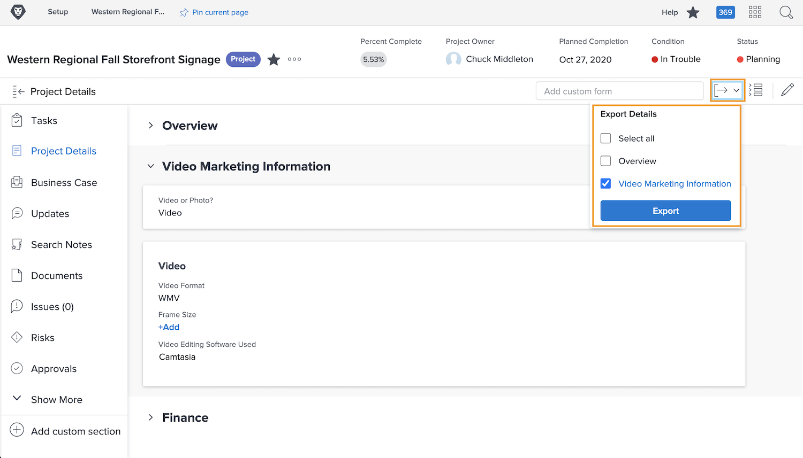
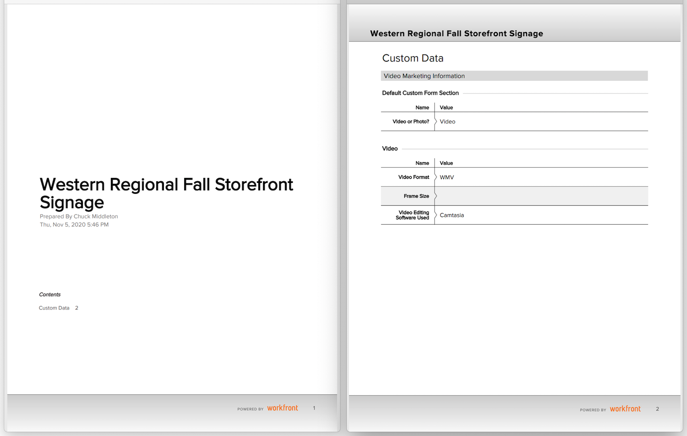

# Exportera ett anpassat formulär som PDF

Att hämta in organisationens unika data är en väsentlig del av arbetshanteringen. Anpassade formulär används ofta för detta ändamål. Genom att kunna exportera anpassade formulär kan de enkelt cirkuleras och delas. Du kan exportera anpassade formulär från projekt, uppgifter eller utgåvor när du öppnar formuläret i [!UICONTROL Detaljer] i objekten.

Du kan även inkludera [!UICONTROL Översikt] området i det exporterade PDF.

Om du till exempel vill exportera ett anpassat formulär med namnet Videomarknadsföringsinformation som är kopplad till ett projekt:

1. Klicka på **[!UICONTROL Exportera]** ikon. Alla anpassade formulär som är kopplade till projektet visas på den nedrullningsbara menyn, inklusive [!UICONTROL Översikt] -avsnitt.
1. Välj Marknadsföringsinformation för video i listan.
1. Klicka **[!UICONTROL Exportera]** längst ned i listan.

En formaterad PDF-fil hämtas.

