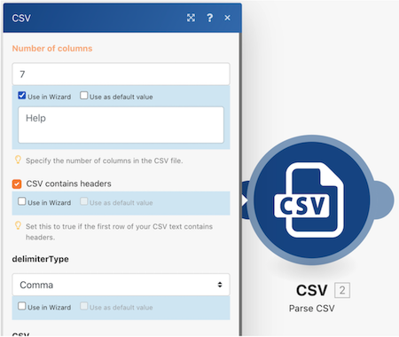

# Tillgänglighet och klarhet

Tidigt i kursen i Workfront Fusion lärde du dig några grundläggande metodtips för att göra scenarier enkla att läsa, dela och förstå. Dessa arbetsmetoder gör det enklare för framtida Workfront Fusion-användare och andra att felsöka eller ge support för din Workfront Fusion-instans. Betala det framåt genom att följa riktlinjerna nedan när du utformar scenarier.

## Etiketter och anteckningar

Ett av de viktigaste målen i Workfront Fusion är i regel alltid att ha enkla scenariodesigner. Här finns några sätt att göra enkla designer att tolka.

* Se till att du namnger alla moduler. Högerklicka på en modul och välj Byt namn. Moduletiketter ska vara korta men ändå lättbegripliga för vad modulen fungerar. Exempel:&quot;Skapa MKG-projekt med Kap-mall&quot;.
  
* Ange även routningssökvägar. Även om en bana inte använder ett filter direkt efter en router kan du använda en etikett utan att fylla i filterlogiken. På så sätt kan andra förstå vilka paket som passerar vilka vägar och varför. Om du vill skapa en etikett för en routersökväg utan filter högerklickar du på sökvägen, lägger till en etikett och sparar.
  
* Lägg till anteckningar där det är tillämpligt i ett scenario om en moduletikett eller en routningsvägsetikett kommer att bli för kort för att förtydliga vad som faktiskt händer. Du kan lägga till anteckningar när du vill under design- och itereringsprocessen.

Det kan dock vara enklast att läsa och förstå om du lägger till anteckningar i slutet av scenariodesignen när du är redo att starta. Arbeta från slutet av scenariodesignen (längst ned till höger) bakåt. På så sätt visas anteckningarna som gäller i början av ditt scenario högst upp i listan när du öppnar anteckningspanelen.

När du har sparat eller stängt anteckningspanelen sorteras anteckningarna med den senast skapade överst. I bilden nedan visas den första anteckningen som skapas längst ned i listan. Anteckningarna skapades avsiktligt från den nedre högra delen till sökvägen ovan och slutligen till utlösaren - i stort sett den omvända ordningen som ett datapaket skulle gå igenom scenariot. Detta gör att anteckningarna visas i den ordning som scenariot faktiskt körs på datapaketet.

## Workfront Fusion-mallar

Ett bra sätt att effektivisera etiketteringen av moduler och routningssökvägar är att använda mallar. Mallar för metodtips kan snabba upp arbetet med att skapa scenarier för vanliga användningsområden.

### Mallexempel

När du startar ett scenario bör du först kontrollera om det finns en tillgänglig mall som kan hjälpa dig. Du vill till exempel skapa ett scenario som börjar med att hämta ett CSV-dokument från Workfront och sedan tolka det.

Klicka på Mallar för att se om några offentliga mallar uppfyller dina behov.

Klicka på fliken Teammallar för att se om någon i ditt team har skapat en mall som kan vara användbar.

Om du hittar en mall som du vill använda klickar du på namnet för att öppna den.

Gå sedan till det övre högra hörnet, klicka på Alternativ och välj Skapa scenario.

### Skapa en mall

Du kan skapa en mall i avsnittet Teammallar. Mallen som du skapar är tillgänglig för dig och ditt team, men när du klickar på knappen Publicera kan du dela den med personer utanför ditt team.

När du skapar mallen kan du inkludera en guide som vägleder de personer som använder den till att bygga sina scenarier, ändra anslutningar, mappade data och andra panelfält efter behov.

Markera kryssrutan Använd i guiden om du vill lägga till instruktioner som är tillgängliga när någon skapar ett scenario med hjälp av mallen. Den här informationen visas i hjälpfältet. Om du vill att användarna ska kunna se den här texten när de använder mallen aktiverar du Använd som standardvärde.

## Vill du veta mer? Vi rekommenderar följande:

[Workfront Fusion - dokumentation](https://experienceleague.adobe.com/docs/workfront/using/adobe-workfront-fusion/workfront-fusion-2.html?lang=en)
