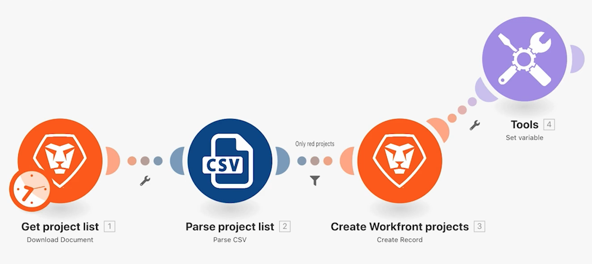

# Få tillgång till tidigare versioner

Lär dig hur du återgår till en tidigare version av ett scenario.

## Översikt över övningar

Upptäck hur du kan återställa tidigare versioner efter att du har gjort ändringar i ett scenario och sparat det flera gånger.

## Steg som ska följas

1. Klona ditt användbara filterscenario och kalla det&quot;Åtkomst till tidigare versioner&quot;.
1. Lägg till variabeln Set efter modulen Create Workfront projects. Ge variabeln namnet&quot;Test&quot;.
1. Dra det till en ny plats och spara scenariot.

   

1. Lägg till en Repeater-modul, bryt länken till den tidigare modulen och spara scenariot igen.

   

1. Ta bort alla dina moduler och spara.
1. Klicka på menyn med tre punkter i verktygsfältet och klicka på alternativet Tidigare versioner. I listan visas datum- och tidsstämplar för varje version som sparas.

   

1. Välj en tidigare version och lägg märke till hur scenariot i designern återgår till där du sparade.
