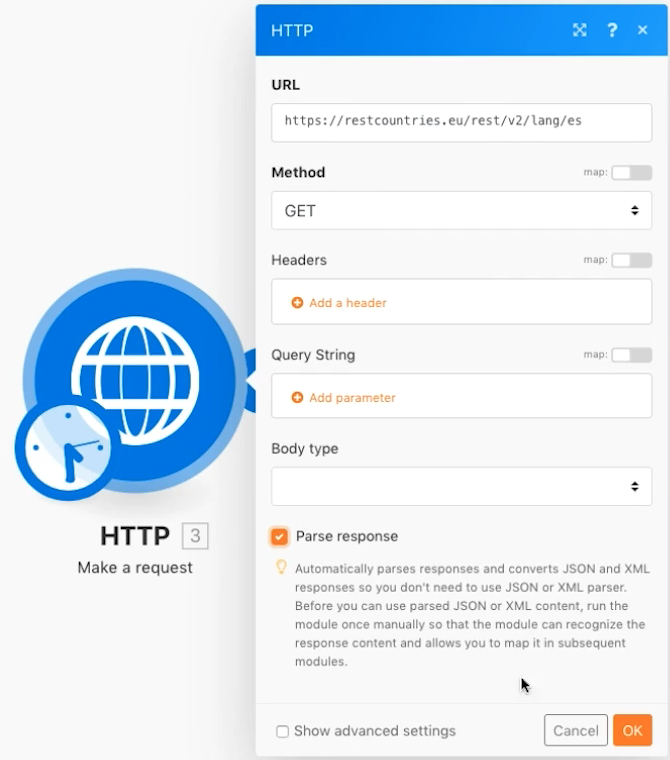

# Avancerad aggregering

Lär dig hur du använder grupperingar vid sammanställning.

## Översikt över övningar

Ring en webbtjänst om du vill returnera information om flera länder och identifiera den totala befolkningen i alla länder, grupperade efter underregion.

## Steg som ska följas

**Hämta landsuppgifter.**

1. Skapa ett nytt scenario och ge det namnet&quot;Avancerad aggregering&quot;.
1. Ställ in utlösarmodulen på en HTTP - Gör en begärandemodul.
1. Använd denna URL, `https://restcountries.com/v2/lang/es`, som ger er en lista över alla länder där spanska talas.
1. Låt metoden vara Get.
1. Klicka i kryssrutan Tolka svar.
1. Byt namn på den här modulen till Hämta länder.
1. Klicka på Spara och kör en gång.

   **Resultatet är ett enda paket, men det finns i en array med 24 samlingar, en för varje spansktalande land.**

   

   **Du måste samla in information om underregioner för varje land, så du måste göra en extra HTTP-begäran.**

1. Lägg till ytterligare en begäran om att få information om underregioner. Det kommer bara att återlämna det första landet, men det är okej för tillfället. Lägg till ytterligare en HTTP Gör en begärandemodul och använd URL `https://restcountries.com/v2/name/{country name}`.
1. Om du vill hämta namnet på det första landet går du till mappningspanelen och klickar på Data och sedan på Namn i arrayen. The [1] i datafältet betyder att det returnerar det första objektet i arrayen.

   + Klicka på numret och ändra indexet om det behövs, men i det här fallet vill du bara ha det första objektet.

1. Markera Analysera svar på mappningspanelen och klicka sedan på OK.
1. Byt namn på&quot;Hämta landsuppgifter&quot;.
1. Klicka på Spara och sedan Kör en gång.

   + Resultatet är information för ett enskilt land.

1. Om du vill få de andra länderna måste du iterera genom arrayen. Lägg till en iterator, som tar en lista över saker och matar ut ett paket för varje objekt i listan.

   **Lägg till iteratorn och aggregatorn.**

1. Högerklicka mellan HTTP-modulerna och lägg till Iterator Flow Control-modulen.
1. Välj Data i modulen Hämta länder i fältet Array.

   

1. I modulen Hämta landsuppgifter uppdaterar du URL-fältet så att det tar namnfältet från iteratorn i stället för från modulen Hämta länder.

   

1. Lägg nu till en numerisk aggregator efter Hämta landsuppgifter för att gruppera och summera populationerna.
1. Källmodulen är iteratormodulen.
1. Sammanställningsfunktionen är SUM.
1. Värdet är [data:population] i modulen Hämta landsuppgifter.
1. Klicka på alternativet Visa avancerade inställningar längst ned och gruppera efter [data:underregion] i modulen Hämta landsuppgifter.

   

   **Slutför med en textaggregator för att sammanställa det du grupperade i den numeriska aggregatorn.**

1. Lägg till en textaggregator i slutet.
1. Källmodulen är den numeriska aggregatorn.
1. I textområdet anger du &quot;The total population of [NYCKEL] är [resultat].&quot;

   

1. Spara och kör en gång.

   + Granska utdata från den sista modulen.
