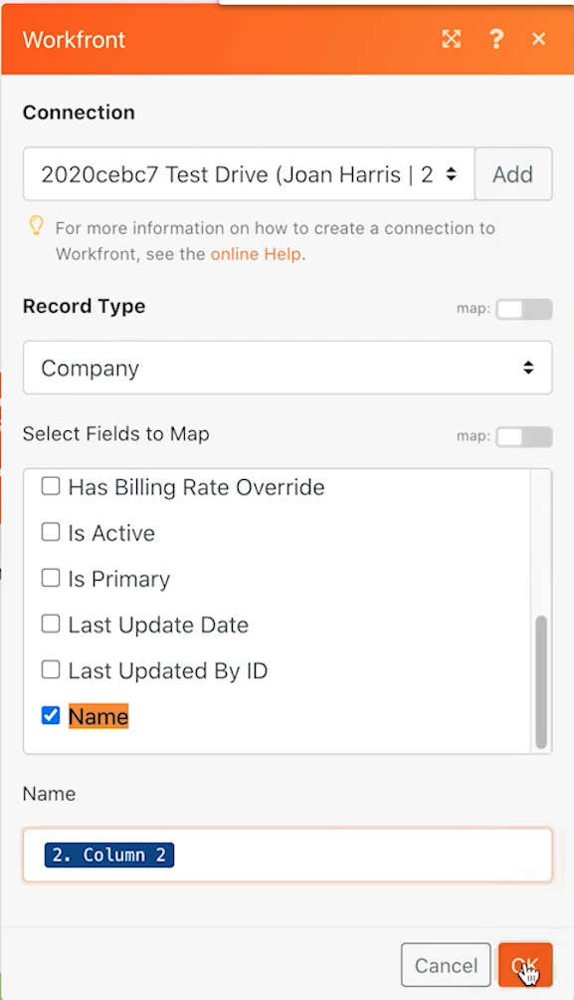

# Datalager

Lär dig hur du synkroniserar företagsnamn mellan två system.

## Översikt över övningar

Detta är den första delen av en enkelriktad synkronisering av företag i Workfront och ett annat system. För närvarande synkroniseras den bara mellan ett Fusion-datalager och Workfront. En tabell i ett datalager håller reda på Workfront-id (WFID) och företags-ID i CSV-filen (CID) för varje företag. Detta möjliggör dubbelriktad synkronisering vid någon tidpunkt i framtiden.

## Steg som ska följas

**Ladda ned filen från Workfront.**

1. I mappen Workfront &quot;Fusion Exercise Files&quot; väljer du &quot;_Companies.csv&quot; och klickar på Document Details.
1. Kopiera det första ID-numret från URL-adressen.
1. I Fusion skapar du ett nytt scenario med namnet&quot;Använda datalager för att synkronisera data&quot;.
1. För utlösarmodulen väljer du modulen Workfront Download Document.
1. Konfigurera din Workfront-anslutning och inkludera det dokument-ID som kopieras från Workfront URL.
1. Ge den här modulen namnet&quot;Hämta företagsfil&quot;.
1. Lägg till en CSV-modul för tolkning.
1. Skriv 2 för fältet Antal kolumner.
1. Mappa data från modulen Hämta dokument i CSV-fältet.
1. Ge den här modulen namnet&quot;Analysera företagsfil&quot;.
1. Spara ditt scenario och klicka på Kör en gång.

   **Skapa ett datalager och en datastruktur.**

1. Lägg till en modul för dataarkivsökningsposter.
1. Skapa ett nytt datalager med namnet&quot;Företagssynkronisering&quot;.
1. Skapa en datastruktur med namnet&quot;Företagssynkronisering (struc)&quot; i datalagret.
1. Skapa fyra fält.

   + CID - Företags-ID i CSV-filen
   + Företag
   + WFID - Workfront företags-ID
   + Skapad -Kontrollera att datatypen är datum

   

1. Klicka på Spara i datastrukturen, ange datalagringsstorleken till 1 och spara datalagret.
1. Fortsätt i datalagermodulen och skapa ett filter där CID är lika med ID:t för företaget från CSV-modulen Parse (kolumn 1).
1. Klicka på Visa avancerade inställningar och välj alternativet att &quot;fortsätta körningen av scenariot eller flödet, även om den här modulen returnerar utan resultat&quot;.

   

1. Byt namn på den här modulen till&quot;Matchande företag&quot;.
1. Lägg till en Workfront Search-postmodul.
1. Välj Företag som posttyp.
1. Sökvillkor är företagsnamnet i Workfront som motsvarar företagsnamnet i CSV-filen.
1. För utdata väljer du företagsnamn och ID.

   

1. Klicka på OK och byt namn på den här modulen till&quot;Matchande företag&quot;.

   **Skapa olika sökvägar baserat på om företaget finns i Workfront eller datalagret.**

   **Routningsväg 1 - Skapa ett företag.**

1. Lägg till en routermodul till höger om postmodulen för Workfront Search.
1. Lägg till en Workfront Create Record-modul i den översta sökvägen.
1. Ange posttypen till Företag.
1. Välj Namn från fält till karta. Mappa namnfältet till utdata från CSV-modulen Parse (kolumn 2).
1. Byt namn på den här modulen till&quot;Skapa företag&quot;.

   

1. Lägg till ett filter efter routern för att bara skapa ett företag om det inte redan finns i Workfront. Kalla det&quot;Inte i Workfront&quot;.
1. Ange villkoret som ID från Workfront Search-modulen och finns inte.

   

   **Förbered uppdatering av datalagret i nästa sökväg.**

1. Lägg till en Set-variabelmodul i slutet av den övre banan.
1. Ange Variabelnamnet till&quot;Workfront ID&quot;.
1. Ange variabelvärdet till ID:t från modulen Skapa företag.
1. Byt namn på den här modulen till Ange Workfront-id.

   **Routningssökväg 2 - Uppdatera datalagret.**

1. Skapa ett filter på routningsbana 2. Kalla det&quot;Inte i datalagret&quot;.

1. Ange villkoret till nyckeln från datalagermodulen och finns inte.

   

1. Den första modulen i den här sökvägen är modulen Hämta.
1. Ange Variabelnamnet till&quot;Workfront ID&quot;.
1. Byt namn på den här modulen till Hämta Workfront-ID.
1. Lägg till en annan modul från datalagerappen, Lägg till/ersätt en post.
1. Välj Företagssynkronisering i fältet Datalager. Det här är datalagret som du skapade tidigare.
1. Lämna fältet Nyckel tomt.
1. Mappa CID-fältet från kolumn 1 i CSV-modulen Parse.
1. Mappa företagsnamnfältet från kolumn 2 i CSV-modulen Parse.
1. Mappa WFID-fältet från modulen Hämta Workfront ID.
1. Använd funktionen formatDate på fliken Datum och tid för fältet Skapat för att formatera det aktuella datumet som MM/DD/ÅÅÅ.

   

1. Klicka på OK och byt namn på den här modulen till&quot;Skapa företagspost&quot;.

   **Routningssökväg 3-Synkronisera datalagret mellan system.**

1. Börja med att skapa ett filter på routningsbana 3. Ge det namnet&quot;Företag finns, inte i datalagret&quot;.
1. Ange villkoret till nyckeln från datalagrets sökpostmodul och finns inte.
1. Klicka på knappen Lägg till OCH regel och ange att företagsnamnet från CSV-filen (kolumn 2) är samma som namnet på det företag som finns i Workfront Search-modulen.

   

1. Lägg nu till en ny Lägg till/ersätt en postmodul genom att klona den i slutet av routningssökväg 2.
1. Dra den klonade modulen på plats i slutet av routningsbana 3. Ta bort den tomma modulen som fanns där.
1. Klicka på den klonade modulen. Alla fält ska vara desamma förutom WFID-fältet. Mappa den från sökmodulen Matchande företag.

   

1. Klicka på OK och byt namn på den här modulen till&quot;Skapa företagspost&quot;.
