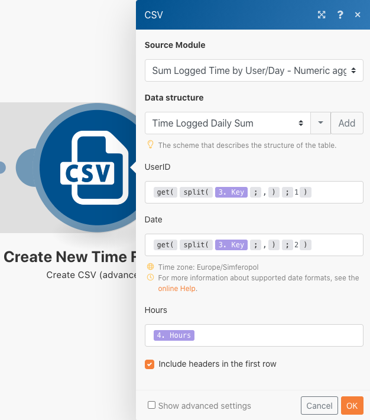

# Datastrukturer

Omvandla data från en källfil till en målfil.

## Översikt över övningar

Öppna en CSV-fil som innehåller en lista med tidsposter. Dessa tidsposter är för minuter och loggas under vissa dagar av flera användare. Målet är att ta med den här informationen och skapa en ny CSV-fil som visar den totala tiden, i timmar, som loggas av varje användare varje dag.

I det här fallet öppnar du en fil som innehåller en lista över tidsposter för arbetade minuter, inklusive datum och tid, hur många minuter som angavs och e-postadressen till vem som gjorde posten. Det finns 100 gångsposter, vissa har gjorts av samma personer och vissa har gjorts samma dag som andra.

Om du vill skapa en fil som visar den totala tiden, i timmar, som varje enskild person har arbetat varje dag, följer du de här stegen:

1. Hämta en fil från Workfront-mappen i modulen Utlösare. Ladda ned filen.
1. I den första CSV-modulen tolkar du tidsinmatningsdata så att ett paket skapas för varje tidsinmatning. Det här är en iterator.
1. Den första verktygsmodul är en numerisk aggregator. Detta SUM alla minuter och grupperar raderna efter e-postadress och sedan efter datum. Resultatet är det totala antalet minuter som bearbetats varje dag via e-postadress.
1. Den andra modulen Verktyg är en Set Variable-modul. Använd detta för att formatera minuterna så att de divideras med 60 och avrundas till 2 decimaler.
1. Ställ in utdatafilen i den andra CSV-modulen.
1. Överför CSV-filen till Workfront i den sista modulen.

## Steg som ska följas

**Ladda ned filen från Workfront.**

1. I mappen Workfront &quot;Fusion Exercise Files&quot; väljer du &quot;_Fusion1.0JanTime.csv&quot; och klickar på Dokumentinformation.
1. Kopiera det första ID-numret från URL-adressen.
1. Skapa ett nytt scenario. Ge den namnet&quot;Skapa och använda datastrukturer&quot;.
1. Börja med modulen Hämta dokument från Workfront.
1. Konfigurera din Workfront-anslutning och inkludera det dokument-ID som du kopierade från Workfront URL.

   

   **Tolka tidsregistreringsdata.**

1. Lägg till en till modul och välj Analysera CSV.
1. Konfigurera CSV för parse för 7 kolumner. Markera rutan CSV innehåller rubriker. Välj Comma delimiterType och ange data i CSV-fältet.

   

1. Klicka på Kör en gång för att visa resultatet.
1. Öppna körningskontrollen för att visa indata och utdata för CSV-modulen Parse. Det finns ett paket (en CSV-fil) som indata och flera paket som utdata (ett paket för varje rad i CSV-filen). Det borde se ut ungefär så här:

   

   **Omvandla sedan data till det önskade utdataformuläret, med summerade tidssummor i timmar istället för minuter.**

1. Lägg till en verktygsmodul för Numerisk aggregator.
1. Välj källmodulen, som är CSV-modulen Parse.
1. Välj SUM för sammanställningsfunktionen.
1. Fältet Värde är kolumn 7 från CSV-filen. Detta är de minuter som loggas av varje användare.
1. Om du vill summera fälten per grupp klickar du på Avancerade inställningar och anger Gruppera efter till e-post (kolumn 4), datum (kolumn 5).

   + Detta summeras för varje kombination av e-postmeddelandet och datumet. Var noga med att placera ett kommatecken mellan kolumn 4 och kolumn 5. Detta kommer att användas som avgränsare senare.

   **Mappningspanelen bör se ut så här:**

   

1. Klicka på Kör en gång för att kontrollera aggregeringsutdata.

   **Utdatapaketen ska se ut så här:**

   

   **Konvertera nu de aggregerade minuterna till timmar.**

1. Lägg till en annan verktygsmodul och välj Ange variabel.
1. Ge variabeln namnet&quot;Timmar&quot;.
1. Ange variabelvärdet till formatNumber(result/60;2;.;,)

   **Mappningspanelen bör se ut så här:**

   

   **Hämta sedan de värden som är inställda för utdatafilen. Du vill att användar-ID och datumvärde ska användas för grupperingarna. Du vill också ha de timmar som har beräknats.**

1. Lägg till en annan modul-CSV-modul med aggregatorn Skapa CSV (avancerat).
1. Källmodulen är aggregatorn Verktyg - Numerisk.
1. Klicka på Lägg till i datastrukturfältet och ge datastrukturen namnet&quot;Time Logged Daily Sum&quot;.
1. Klicka på Lägg till objekt för att skapa det första objektet.
1. Ge objektet namnet &quot;UserID&quot; och ange typen till Text. Klicka på Lägg till.
1. Klicka på Lägg till objekt igen för att skapa det andra objektet.
1. Ge objektet namnet&quot;Datum&quot;, ange typen till Datum och klicka på Lägg till.
1. Klicka på Lägg till objekt en gång till.
1. Ge objektet namnet&quot;Timmar&quot;, ange typen till Nummer och klicka på Lägg till.

   **Din datastruktur bör se ut så här:**

   

1. Klicka på Spara för att avsluta datastrukturen Time Logged Daily Sum.

   **Nu anger du värdena för de tre fält du just skapade. Du bör se de tre fälten på panelen CSV-mappning.**

1. Klicka i fältet UserID och välj GET på fliken General functions. I den första parametern ställer du in SPLIT från fliken för text och binära funktioner. Den första parametern för SPLIT-funktionen är Key-fältet. Lägg till ett kommatecken som avgränsare och 1 som index. Detta anger att du vill att GETEN ska hämta det första fältet i Key-arrayen.
1. Kopiera det här uttrycket till datumfältet. Ändra indexvärdet från 1 till 2 till GET det andra värdet i arrayen.
1. För fältet Timmar lägger du till fältet Timmar från verktyget Ange variabel.

   **CSV-mappningspanelen ska se ut så här:**

   

   **Om du kör scenariot nu bör du se följande utdata:**

   

   **Nu kan du lägga till en modul för att ta det här resultatet och överföra det som ett dokument till ett befintligt projekt i Workfront.**

1. Öppna projektet i Workfront och kopiera projekt-ID:t från URL:en.
1. Gå tillbaka till scenariot i Fusion och lägg till en annan modul - modulen Överför dokument från Workfront-appen.
1. Klistra in projekt-ID i fältet Relaterat post-ID.
1. Välj Projekt för den relaterade posttypen.
1. Välj alternativet Karta för källfilen.
1. Använd det filnamn du hämtade som dokumentnamn och lägg till&quot;Uppdaterat&quot; framför det.
1. Använd textutdata från modulen Skapa CSV för filinnehållet.

   **Mappningspanelen bör se ut så här:**

   

1. Klicka på OK och Spara scenariot.
1. Klicka på Kör en gång för att köra scenariot.

   **Kontrollera körningskontrollen i modulen Överför dokument för att bekräfta att dokumentet har överförts.**

   