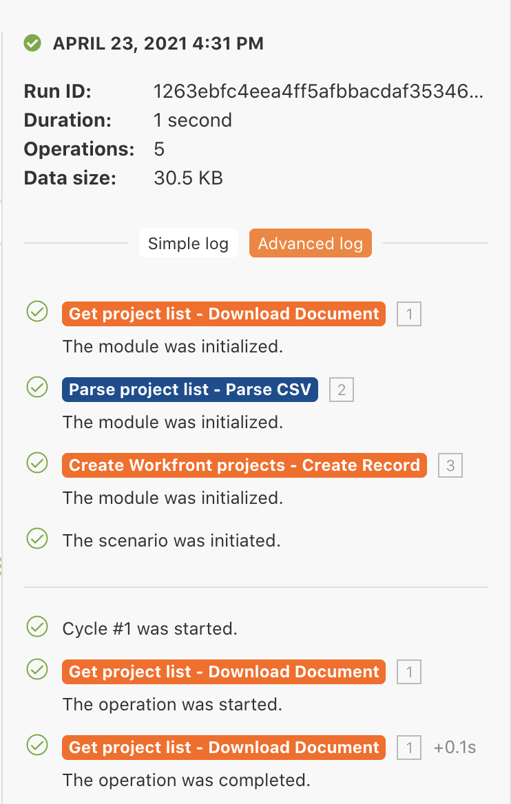

# Körningshistorik

Granska och granska information om tidigare körningar och scenariokonfigurationer.

## Översikt över övningar

Granska körningshistoriken för scenariot&quot;Använda det kraftfulla filtret&quot; för att förstå vad som hände när körningar utfördes och hur de strukturerades när de kördes.

## Steg som ska följas

1. Öppna scenariot &quot;Använda det kan filtrera&quot;.
1. På översiktssidan klickar du på fliken Historik (längst upp, under scenarionamnet).

   

1. Hitta en körning och klicka på informationsknappen för att öppna en sida som visar de specifika åtgärder som har utförts (eller inte utförts) i den högra panelen. I den vänstra panelen kan du undersöka scenariot på samma sätt som vid körningen.

   

1. När du klickar på en modul i scenariopanelen visas en modulkontrollpanel med information om modulens inställningar. Klicka på körningskontrollen bredvid en modul eller ett filter för att se vilka informationspaket som kördes.

   

   

1. I den högra panelen bläddrar du igenom eller klickar i den enkla loggen för att visa information om körningens&quot;play-by-play&quot;.

   + Du kan se när åtgärder slutfördes i moduler och när paket skickades (eller inte godkändes) via filter.

   

   + Klicka på ett loggobjekt för att öppna åtgärdspanelen i scenariopanelen. Loggarna listas i kronologisk ordning efter när de inträffade.

   

1. I loggen Avancerat visas liknande information. Den ger dock mer information om hur många cykler som har körts per körning och gör att du kan utforska vilka informationspaket som har bearbetats under varje cykel.

