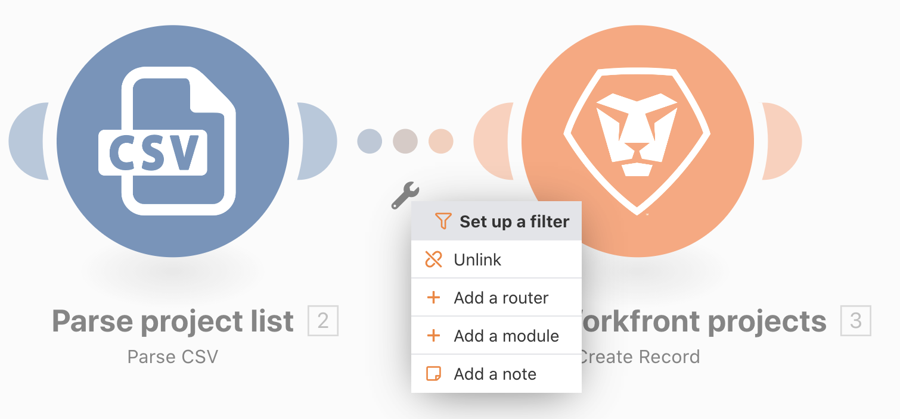

# Filter

Lär dig hur du använder filtret mellan moduler för att bara tillåta vissa typer av paket genom.

## Översikt över övningar

Lägg till ett filter mellan de två modulerna i Beyond Basic-mappningsscenariot för att endast skapa projekt som har en röd projektfärg i CSV-filen.

## Steg som ska följas

1. Skapa en klon av scenariot&quot;Beyond basic mapping&quot; och ge det namnet&quot;Using the mäktige filter&quot;.

   **Lägg till ett filter före modulen Skapa Workfront-projekt så att endast röda projekt kan skapas.**

   

1. Lägg till ett filter genom att klicka på den prickade linjen som förbinder modulerna eller klicka på skiftnyckeln och välja Konfigurera ett filter.
1. Använd fältet Etikett för att ge filtret namnet&quot;Endast röda projekt&quot;.
1. Mappa fältet Projektfärg (kolumn 3 i CSV-filen) i fältet Villkor. Välj operatorn Lika med (skiftlägesokänslig) och skriv sedan &quot;red&quot;.
1. Klicka på OK.

   

   **Testa filtret och verifiera resultatet.**

1. Klicka på Spara för att spara scenariot och sedan på Kör en gång.
1. Klicka på filtrets körningskontroll för att se hur varje paket granskades av filtret och antingen gick vidare eller inte gick vidare till modulen Skapa Workfront-projekt.

   

1. Hitta de projekt du har skapat i din Workfront-instans.
