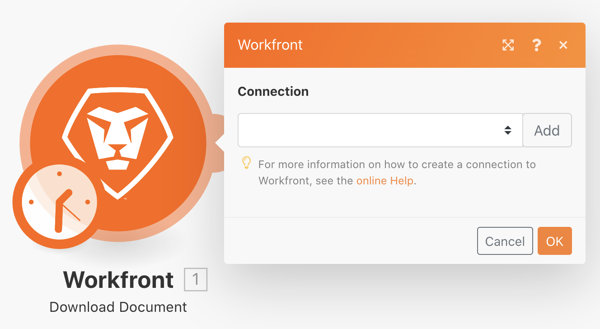

# Utformning av första scenariot

Lär dig några grundläggande navigeringstips när du loggar in på Workfront Fusion och skapar ditt första scenario.

## Förutsättningar

1. För den här övningen krävs en testkörning från Workfront. Du kan begära en genom att fylla i [det här formuläret](https://forms.office.com/r/f1J8HRGrNY). Om du inte kan komma åt formuläret skickar du ditt namn, din e-postadress och ditt företagsnamn till wfttstdr@adobe.com.
1. Fusion-övningar förutsätter att du har sett genomgången video som motsvarar övningen. I det här fallet är det [Genomgång av inledande scenariodesign](https://experienceleague.adobe.com/docs/workfront-learn/tutorials-workfront/fusion/understand-the-basics/initial-scenario-design-walkthrough.html?lang=en).

## Översikt över övningar

Skapa ett nytt projekt i Workfront för varje rad i CSV-filen för projektlistan.

## Steg som ska följas

1. Skapa en mapp i avsnittet Scenario som heter&quot;Aktiveringsövningar för Fusion&quot;.
1. Klicka på mappen och sedan på Skapa ett nytt scenario.

   

1. På nästa sida söker du efter Workfront och väljer det programmet. Klicka sedan på Fortsätt.
1. Längst upp till vänster på skärmen för scenariodesignern byter du namn på ditt scenario till&quot;Utformning av inledande scenario&quot;
1. Klicka på den tomma utlösarmodulen mitt på skärmen och välj Workfront-appen. Välj sedan modulen Hämta dokument.

   **Verifiera modulens anslutning till ditt Workfront-konto.**

1. Om du vill skapa en anslutning för första gången klickar du på knappen Lägg till.

   

1. Ge anslutningen ett namn, till exempel&quot;My Workfront 2020&quot;

   

1. Ange URL:en för **ditt Workfront-testenhetskonto** och klicka sedan på Nästa.

   

1. Ange ditt lösenord och klicka på Logga in.

   **Anslutningen har upprättats. Ange dokument-ID för dokumentet som du vill hämta från Workfront.**

   

1. Gå tillbaka till Workfront. I mappen&quot;Fusion Exercise Files&quot; väljer du &quot;_Fusion2020_Project List.csv&quot; och klickar på Document Details (Dokumentinformation) i den vänstra panelen. Kopiera dokument-ID-numret från URL-adressen (det här är det första långa numret i URL-adressen).

   

1. Gå tillbaka till Fusion, klistra in numret i fältet Dokument-ID och klicka på OK.
1. Det bästa sättet är att byta namn på moduler när du skapar dem. Högerklicka på modulen Workfront och välj Byt namn. Ge modulen namnet&quot;Hämta projektlista&quot;.

   **Därefter ska du analysera CSV-filen som du just laddat ned så att du kan komma åt varje rad i filen. Du använder den här informationen när du skapar ett projekt från varje rad.**

1. Klicka på höger sida i Workfront-modulen för att lägga till en annan modul. Sök efter CSV-appen och välj CSV-modulen Parse.
1. Konfigurera Parse CSV för 6 kolumner, CSV innehåller rubriker, Comma delimiterType och data i CSV-fältet. Klicka sedan på OK.

   

1. Byt namn på den här modulen till&quot;Analysera projektlista&quot;.
1. Klicka på Spara längst ned i scenariodesignern för att spara scenariot.
1. Klicka på Kör en gång för att visa resultatet.

   >[!NOTE]
   >
   >Ignorera varningen om att en transformator inte ska vara den sista modulen (detta är sant, men spelar ingen roll för det här testet). Klicka på Kör ändå.

   

1. Öppna körningskontrollen i CSV-modulen Parse för att se indata och utdata för modulen. Det finns ett paket (en CSV-fil) som indata och flera paket som utdata (ett paket för varje rad i CSV-filen). Det borde se ut ungefär så här:

   

   **Lägg till en modul för att skapa ett projekt för varje rad i CSV-filen.**

1. Lägg till en till modul. Markera Workfront-programmet och välj modulen Skapa post.
1. Ange posttypen som Projekt.

   >[!TIP]
   >
   >Sök efter den genom att börja skriva några bokstäver, till exempel *proj*, för att gå direkt till den.

1. Använd sedan Cmd/Ctrl+G för att hitta namn (projektnamn). Markera rutan bredvid Namn. Fältet visas nedan.
1. Markera nu rutorna bredvid Planerat startdatum och prioritet.
1. Klicka i fältet Namn så att mappningspanelen visas. Klicka på fältet Kolumn 1 i modulen Analysera CSV för att lägga till det i fältet Namn. Det här är projektnamnet från CSV-filen.
1. Klicka på Kolumn 5 i modulen Analysera CSV för det planerade startdatumet.
1. Välj Normal i listrutan Prioritet.

   **Mappningspanelen ska se ut så här:**

   

1. Klicka på OK.

   >[!NOTE]
   >
   >Om du inte klickar på OK och av misstag klickar tillbaka i designern sparas inte ditt arbete och du måste mappa om.

1. Högerklicka på modulen Workfront och byt namn till&quot;Skapa Workfront-projekt&quot;.
1. Spara ditt scenario och klicka på knappen Kör en gång.
1. Klicka på körningskontrollen längst upp till höger i den sista modulen.

   + Du ser att 20 åtgärder har utförts. Varje åtgärd tog ett paket, det vill säga en rad, från CSV-filen som indata och utdata i ett paket, vilket var ett projekt som skapades i Workfront. Projekt-ID:t för projektet som skapas visas med utdatapaketet.

   

   **Använda anteckningar**

1. Anteckningar hjälper till att skapa mer synlighet i scenariodesignen. Om du vill lägga till en anteckning i modulen Skapa Workfront-projekt högerklickar du och väljer Lägg till en anteckning. En panel till höger om designerfönstret öppnas så att du kan lägga till en anteckning i modulen. Skriv&quot;Skapa ett projekt med namn, planerat startdatum och prioritet mappat från CSV-filen.&quot;
1. Lägg till en annan anteckning som beskriver vad utlösarmodulen (den första Workfront-modulen) gör.
1. Stäng anteckningspanelen genom att klicka på krysset i det övre högra hörnet.

   + Du öppnar anteckningarna igen genom att klicka på anteckningsknappen i det nedre verktygsfältet eller genom att högerklicka på en modul och lägga till en ny anteckning.
   + Anteckningarna sorteras i omvänd kronologisk ordning.
   + En orange punkt visas på knappen Anteckningar när anteckningar har lagts till.

   

1. Spara scenariot genom att klicka på knappen Spara i kontrollverktygsfältet.
1. Du kan visa projekt som skapats i din Workfront-instans.
