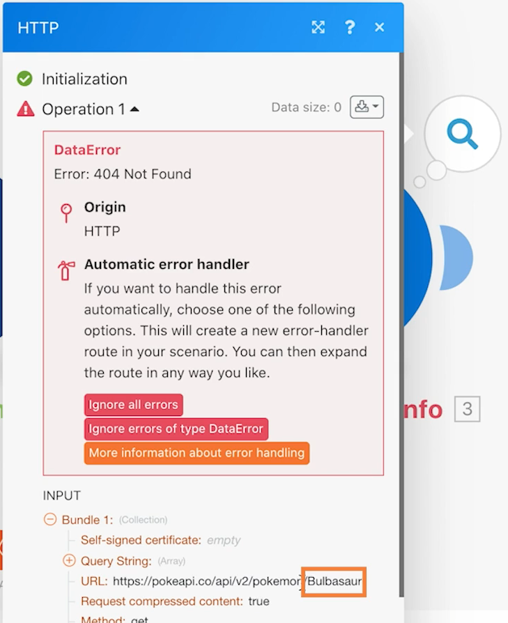
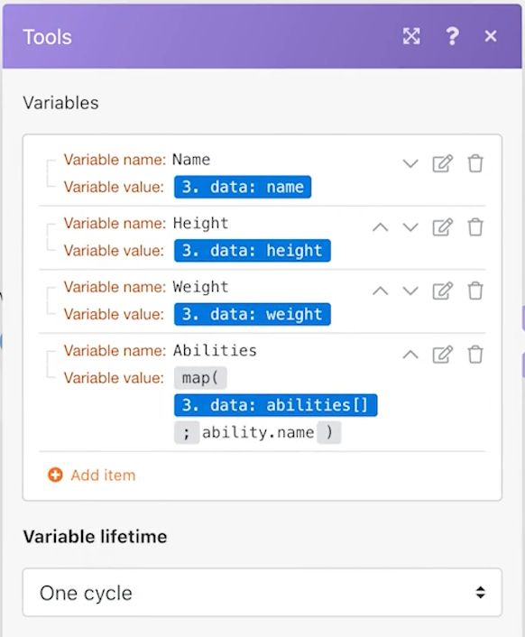

# Introduktion till övning med universella kopplingar

Få en bättre förståelse för att arbeta med universella REST-anslutningar och arbeta med returnerade data.

## Översikt över övningar

Om du använder ett Pokemon-tecken i ett kalkylblad kan du anropa Poke API via en HTTP-anslutning för att samla in och publicera mer information om det tecknet.

## Steg som ska följas

**Hämta CSV-filen från Workfront.**

1. I mappen Workfront &quot;Fusion Exercise Files&quot; väljer du &quot;_Fusion2020_Shipping Manifest.csv&quot; och klickar på Dokumentinformation.
1. Kopiera det första ID-numret från URL-adressen.
1. Skapa ett nytt scenario i Workfront Fusion. Ge den namnet&quot;Använda universella anslutningar&quot;.
1. Börja med modulen Hämta dokument från Workfront.
1. Konfigurera din Workfront-anslutning och inkludera det dokument-ID som du kopierade från Workfront URL.
1. Byt namn på den här modulen till&quot;Hämta leveransmanifest&quot;.

   

   **Tolka data i leveransmanifestet.**

1. Lägg till en till modul och välj Analysera CSV.
1. Konfigurera CSV för parse för 11 kolumner. Markera rutan CSV innehåller rubriker. Välj kommaavgränsartyp och skicka data från modulen Hämta dokument i CSV-fältet.

   

1. Byt namn på den här modulen till&quot;Parsa leveransmanifest&quot;.
1. Spara scenariot och klicka på Kör en gång så att du kan se data från CSV-filen i nästa steg.

   **Hämta Pokemon-data med den universella kopplingen.**

1. Lägg till en HTTP Make a Request-modul.
1. I URL-fältet använder du `https://pokeapi.co/api/v2/pokemon/[Character]`, där [Tecken] är mappad till kolumn 3 från CSV-modulen Parse.
1. Markera kryssrutan Tolka svar.
1. Markera Visa avancerade inställningar och markera sedan kryssrutan intill &quot;Utvärdera alla lägen som fel&quot;.
1. Klicka på OK och byt namn på modulen&quot;Hämta Pokemoninformation&quot;.

   **Mappningspanelen bör se ut så här:**

   

   **I den här delen av övningen vill du bara bearbeta rad 1 i CSV-filen.**

1. Lägg till ett filter före din Get Pokemon info-modul. Ge den namnet&quot;Endast rad 1&quot;.
1. Ange villkoret så att ID-nummer 1 bara kan skickas. ID-nummer 1 finns på rad 1 och ID-fältet finns i kolumn 1 i CSV-filen.

   

1. Spara scenariot.
1. Klicka på Run Once (Kör en gång) och observera felmeddelandet som du får i modulen HTTP Make a request.

   >[!IMPORTANT]
   >
   >Observera att teckennamnet är versalt i URL-fältet för indata. Det här fungerar inte för API-anrop eftersom teckennamn måste vara gemener.

   

1. Använd mappningspanelen i fältet HTTP Make a request URL för att skapa [Tecken] fältmarkera alla gemener med **nedre** funktion.

   

   **Mappa tillbaka information från API:t med modulen Ange flera variabler.**

1. Lägg till modulen Ange flera variabler efter Hämta Pokemon-information. Kartnamn, höjd, vikt och egenskaper.
1. Eftersom fältet Abilities är en array måste du komma ihåg att använda mappningsfunktionen för att komma åt namnet på varje funktion i arrayen.

   

   **Kör scenariot utan filtret för att identifiera ett annat fel.**

1. Om du vill bearbeta alla rader i CSV-filen tar du bort filtret Endast rad 1:

   + Klicka på filterikonen för att redigera den.
   + Ta bort filteretiketten.
   + Ta bort villkoret.
   + Klicka på OK.

1. Spara scenariot och klicka på Kör en gång.
1. Ett fel inträffar i informationsmodulen Hämta Pokemon. En superhjälte har skickats till Pokemons API.

   >[!NOTE]
   >
   >I genomgången av Routers ser du hur du löser det här felet genom att skapa en separat väg till processsuperhjältar.

   
