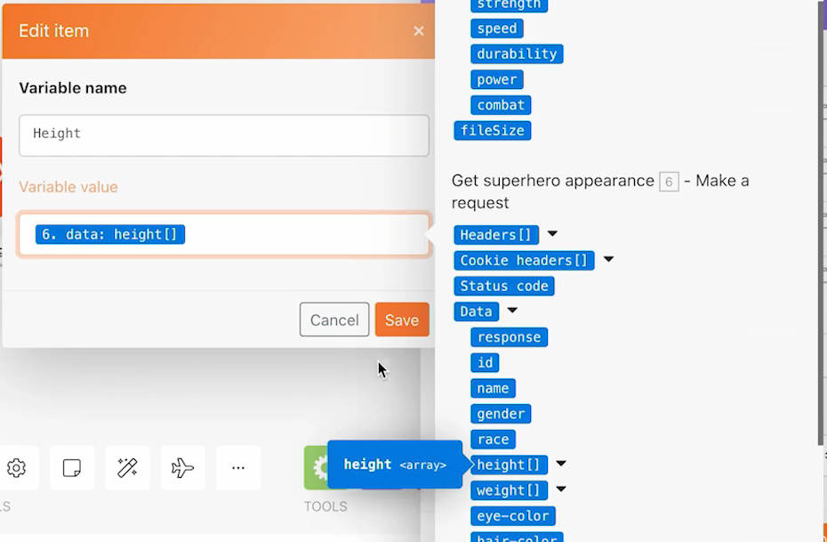

# Routrar

Förstå vikten av routrar och hur de kan användas för att bearbeta olika moduler på ett villkor.

## Översikt över övningar

Använd en router för att skicka Pokemon kontra superhjältar i paket längs rätt bana och skapa sedan en uppgift för varje tecken.

## Steg som ska följas

1. Klona scenariot Använda universella kopplingar från föregående övning. Kalla det&quot;Skapa olika sökvägar med routrar&quot;.

   **Skapa en ny sökväg för superhjältar genom att klona moduler och lägga till en router.**

   

1. Högerklicka på modulen Hämta Pokemoninformation och välj Klona. När du har klonat drar och ansluter du den till linjen mellan den nya HTTP-modulen och CSV-modulen Parse.

   >[!NOTE]
   >
   > Lägg märke till hur en router med två banor läggs till automatiskt.

1. Ge den här modulen namnet&quot;Get superhero appearance&quot;.
1. Klona den här modulen, flytta klonen åt höger och kalla den&quot;Get superhero abilities&quot;.
1. Klona modulen Verktyg och flytta den till slutet av den andra banan.
1. Klicka på handikonen i verktygsfältet - knappen Justera automatiskt.

   **Scenariot bör se ut så här:**

   

   **Därefter ska du ändra mappade värden i de nya klonade modulerna.**

1. Gå till <https://www.superheroapi.com/> och använd ditt Facebook-konto för att få en åtkomsttoken.

   >[!NOTE]
   >
   >Om du har problem med att komma åt din egen superhjälte-token kan du använda den här delade token: 10110256647253588. Tänk på hur många gånger du anropar superhjälte-API:t så att denna delade token fortsätter att fungera för alla.

1. Öppna inställningarna för superhjälteutseendet Get och ändra URL:en till https://www.superheroapi.com/api/[access-token]/332/appearance. Inkludera din åtkomsttoken i URL:en. Klicka på OK.
1. Öppna inställningarna för superhjälpen Get och ändra URL:en till https://www.superheroapi.com/api/[access-token]/332/powerstats. Inkludera din åtkomsttoken i URL:en. Klicka på OK.
1. Högerklicka på varje superhjältemodul och välj Kör endast den här modulen. Detta genererar den datastruktur som du behöver se för mappning.
1. När du har kört båda ändrar du talet &quot;332&quot; i varje URL-fält till Column 4 som mappats från CSV-modulen Parse.

   

   **Nu kan du klicka i modulen Ange flera variabler i den superhjältebanan och uppdatera namn, höjd, vikt och funktioner.**

1. Uppdatera fälten Namn och Tillgänglighet i Get superhero abilities module 8.

   

1. Uppdatera fälten Höjd och Bredd i superhjälteutseendemodulen Get - Modul 6.

   

   **När du är klar bör variablerna se ut så här. Observera att modulnumren visas i fältvärdena.**

   

1. Klicka på OK och spara sedan ditt scenario.

   **Skapa en annan bana för att skapa en uppgift per tecken.**

1. Skapa ett tomt projekt i Workfront. Ge den namnet&quot;Shipping Manifest Project&quot; och kopiera projekt-ID:t från URL:en.
1. Gå tillbaka till Workfront Fusion och klicka mitt i routern för att skapa en ny sökväg.

   

1. Klicka mitt i den tomma modulen som visas och lägg till en Create record-modul från Workfront-appen.
1. Ange Posttyp till Aktivitet och välj Projekt-ID under Fält till karta.
1. Klistra in det projekt-ID som du kopierade från Workfront i fältet Projekt-ID.
1. Välj nu fältet Namn i området Fält till karta.
1. Namnge uppgiften[Tecken] från [Franchise],&quot; med teckennamnet och franchise-namnet från CSV-filen. Kolumn 3 är teckennamnet och kolumn 2 är franchisens namn.

   

1. Klicka på OK och byt namn på modulen till&quot;Skapa en uppgift för varje tecken&quot;.

   **Lägg till filter så att scenariot kan köras utan fel. Du vill att bara Pokemon-tecken ska hamna längs den översta banan, bara superhjältetecken att gå nedåt i den mittersta banan och alla tecken att gå nedåt.**

1. Klicka på den prickade linjen till vänster om modulen Get Pokemon info för att skapa det första filtret. Ge den namnet&quot;Pokemontecken&quot;.
1. För villkoret tillåts bara poster där franchise (kolumn 2) är lika med &quot;Pokemon&quot;. Välj operatorn &quot;Lika med&quot;.
1. Klicka på den prickade linjen till vänster om Get superhero-utseendemodulen för att skapa nästa filter. Kalla det &quot;superhjälte&quot;.
1. Eftersom superhjältar kan komma från olika franchisar använder du fältet Superhero-ID (kolumn 4) för att avgöra om en figur är en superhjälte eller inte.

   **Dina filter bör se ut så här:**

   

   

1. Spara scenariot och klicka på Kör en gång. Använd körningskontrollerna för att kontrollera att alla åtgärder har slutförts och kontrollera uppgifter som har skapats i ditt Workfront-projekt.

   
