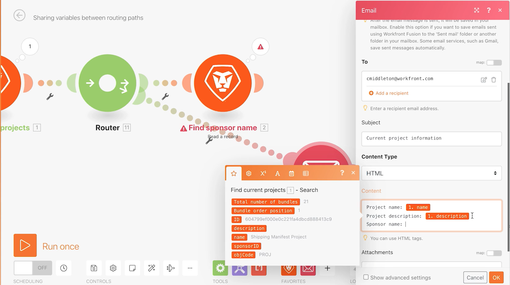

# Använd/hämta variabelövning

Lär dig hur du använder modulerna Ange och Hämta variabel för att använda fälten som finns i en sökväg i en annan sökväg.

## Översikt över övningar

Hitta information om ett projekt i Workfront och skicka ett e-postmeddelande med relaterad information.

## Steg som ska följas

1. Skapa ett nytt scenario och ge det namnet&quot;Dela variabler mellan routningssökvägar&quot;.
1. För utlösaren väljer du modulen Sök i Workfront-appen.

   + Ange Posttyp till Projekt.
   + Välj Alla matchande poster i resultatuppsättningen.
   + För sökvillkor ställer du in det på Status lika med CUR.
   + För Utdata väljer du ID, Namn, Beskrivning och Sponsorn-ID.

   

   

1. Klicka på OK och byt namn på den här modulen till&quot;Sök efter aktuella projekt&quot;.
1. Lägg till en annan modul och välj Workfront Läs en post-modulen.

   + Välj Användare som posttyp.
   + Välj Namn för Utdata.
   + Mappa sponsor-ID från sökmodulen till ID-fältet.

1. Klicka på OK.
1. Byt namn på modulen&quot;Hitta sponsernamn&quot;.

   

1. Spara scenariot och klicka på Kör en gång.

   Om du får ett fel i modulen Läs en post beror det troligen på att sökmodulen har hittat ett projekt utan någon sponsor.

   **Om du vill undvika det här felet skapar du två sökvägar: en för projekt som har ett sponsor-ID och en för projekt som inte gör det.**

1. Lägg till en router mellan de två modulerna genom att klicka på skiftnyckelsikonen mellan routern och modulen Läs en post. Ställ in ett filter med namnet&quot;Sponsorn finns&quot; och ställ in villkoret till Sponsorns ID finns.

   

1. Klicka på routern för att skapa en annan sökväg. Lägg till en Skicka ett e-postmodul från e-postappen.

   + Placera din egen e-postadress i fältet Till.
   + Skriv&quot;Aktuell projektinformation&quot; i fältet Ämne.
   + Ange projektnamnet, beskrivningen och sponsorn i fältet Innehåll.
   + Du kan inte hämta sponsorns namnutdata från modulen Läs en post. Du kan bara få åtkomst till ditt sponsor-ID från sökmodulen före routern. Du måste hitta ett sätt att komma åt sponsorns namn från den andra routerns sökväg.

   

1. Klicka på OK för tillfället och byt namn på modulen&quot;Skicka projektinformation&quot;

   **Använd Set/Get-variabler för att dela data mellan olika sökvägar.**

1. Efter Sök efter sponsorns namnmodul lägger du till modulen Ange variabelverktyg.

   + Ange&quot;Sponsornamn&quot; som variabelnamn.
   + Låt livstiden för variabeln vara en cykel.
   + Mappa fältet till namnutdata från modulen Sök sponsornamn.

1. Klicka på OK och byt sedan namn på modulen&quot;Ange sponsernamn&quot;.

   

1. Högerklicka sedan mellan routern och modulen Skicka ett e-postmeddelande för att lägga till en Get-variabelverktygsmodul. Ange&quot;Sponsornamn&quot; i fältet Variabelnamn.
1. Klicka på OK. Byt namn på modulen &quot;Hämta sponsernamn&quot;.

   

1. Gå tillbaka till modulen Skicka ett e-postmeddelande och mappa värdet från modulen Hämta sponsernamn till innehållsfältet. Klicka på OK.

   

   >[!IMPORTANT]
   >
   >Innan du testar scenariot rekommenderar vi att du begränsar antalet projekt som du bearbetar för att undvika en översvämning av e-postmeddelanden.

1. Gå till testkörningen i Workfront och leta upp projektet Northstar Fashion Exhibitors Booth. Detta är ett aktuellt projekt som har en sponsor. Kopiera projekt-ID från URL:en.

   

1. I ditt scenario klickar du på modulen Sök aktuella projekt. Lägg till ytterligare ett villkor i sökvillkoren genom att klicka på den gröna knappen &quot;Lägg till OCH regel&quot;. Ange att ID:t måste vara samma som det projekt-ID du kopierade. Klicka på OK.
1. Spara ditt scenario och klicka på Kör en gång.
1. Granska körningskontrollerna och det e-postmeddelande du får.

   
