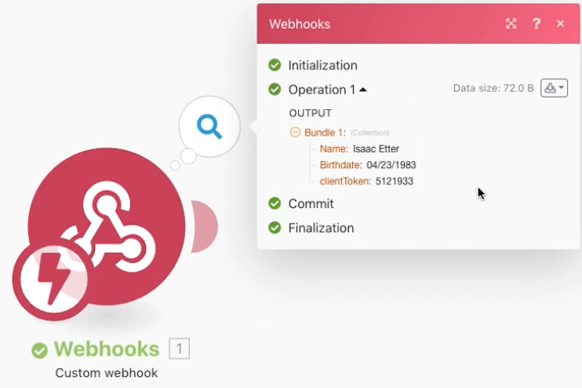

# Webbhooks-övning

Lär dig hur du skapar, utlöser och hanterar webkrosinitierade scenarier.

## Översikt över övningar

Syftet med det här scenariot är att skapa en app för att sälja till butiker så att de enkelt kan avgöra om en kund är gammal nog att köpa alkohol eller inte. Kassören behöver bara publicera kundens namn och födelsedatum till en URL som de har fått. Inlägget utlöser scenariot som beräknar svaret och returnerar det till den som gjorde begäran.

1. Scenariot består av tre webbhooks.
1. Utlösarmodulen är en anpassad webkrok som lyssnar efter ett inlägg.
1. När det tar emot ett inlägg kommer det att skrivas ut i en av de följande modulerna.
1. Nästa modul returnerar ett svar till den som gjorde begäran.

   

## Steg som ska följas

**Konfigurera den utlösande webbkroken.**

1. Skapa ett nytt scenario och kalla det&quot;Använda webbhooks&quot;.
1. För utlösaren lägger du till den anpassade webbkrokmodulen från Webhooks-appen.
1. Klicka på Lägg till om du vill skapa en ny webkrok.
1. Ange webkrokens namn för&quot;Drinking age app&quot;.
1. Lämna IP-begränsningarna tomma, vilket innebär att alla kan skicka data till dem.
1. Klicka på Spara.

   

1. På panelen Webhooks-mappning har en URL skapats för den här specifika webkroken. Klicka på Kopiera adress till Urklipp för att kopiera URL:en.
1. Klicka på OK.
1. Klicka på Kör en gång.
1. Använd URL:en i Postman för att skicka ett namn och födelsedatum till din anpassade webkrok. Instruktioner om hur du konfigurerar Postman finns i [Genomgång av webbhooks](https://experienceleague.adobe.com/docs/workfront-learn/tutorials-workfront/fusion/beyond-basic-modules/webhooks-walkthrough.html?lang=en) självstudie.

   **Webhooks-modulpanelen bör se ut så här:**

   

   **Webbkroken är nu i ett läge där den lyssnar efter data för att fastställa datastrukturen.**

1. Du kan definiera datastrukturen för den nyttolast som du förväntar dig att hämta (datastrukturen beskrivs senare). Om du inte definierar någon datastruktur kommer Fusion att bestämma datastrukturen automatiskt när inlägget skickas.
1. På Postman-sidan vill du skicka till den kopierade URL:en. Posten ska innehålla grundläggande formulärdata. I det här exemplet behöver du tre fält: Name, Birthdate och clientToken.

   

1. När du har klickat på Skicka från Postman bör du få en indikation på att inlägget har godkänts.
1. Detta är den punkt där ditt scenario kommer att visa att datastrukturen har bestämts.
1. Du kan se att data har tagits emot genom att öppna körningskontrollen.

   

   **Ställ in routning för klienttoken.**

1. Lägg till en router i utlösarmodulen.
1. Lägg till en Webkroks svarsmodul i den övre banan. Detta är vår väg när klientens token inte matchar.
1. Ange status till 401.
1. Ställ in brödtexten på {&quot;error&quot;:&quot;Det gick inte att autentisera begäran. Kontrollera din clientToken&quot;}.

   

1. Skapa ett filter mellan routern och Webkroks svarsmodul. Kalla det &quot;Klienttoken matchar inte.&quot;
1. Använd fältet clientToken från utlösarmodulen för Condition och gör en numerisk jämförelse &quot;Inte lika med&quot; med talet 5121933.

   

1. Lägg till en till Webkroks svarsmodul i den nedre banan. Detta är vår väg när klientens token matchar.
1. Ange status till 200.
1. När du konfigurerar brödtexten använder du mappningspanelens funktioner för att testa om personen är 21 eller äldre. Om de är det, returnera &quot;Du är gammal nog att dricka!&quot;, annars returnerar du &quot;Du har otur..&quot;

   

1. Skapa ett filter mellan routern och Webkroks svarsmodul på den nedre sökvägen. Kalla det &quot;Klienttoken matchar inte.&quot;
1. Använd fältet clientToken från utlösarmodulen för Condition och gör en numerisk &quot;Lika med&quot;-jämförelse med talet 5121933.

   

1. Klicka på knappen Schemaläggning under Kör en gång för att aktivera ditt scenario så att du, när det kommer ett nytt inlägg, går ned på båda vägarna och genererar ett svar.
