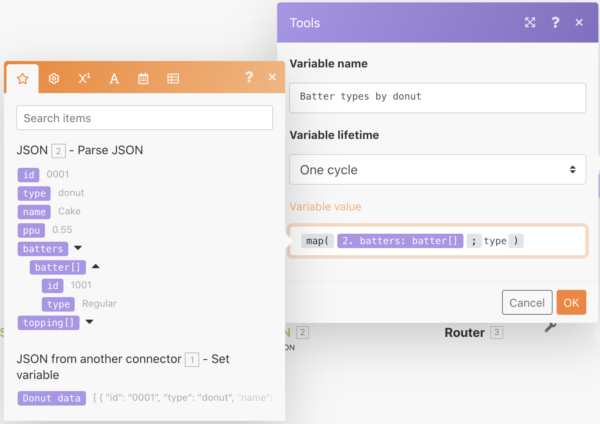

# Arbeta med JSON-övning

Lär dig hur du skapar och tolkar JSON i ett scenario som passar dina designbehov.

## Översikt över övningar

Syftet med den här övningen är att konceptuellt visa hur man använder information som skickas till ett scenario i JSON-format och tolkar den i fält och objekt som du kan mappa genom hela scenariot. Sedan kan du hämta information från dessa mappade arrayer eller samla informationen i JSON för att sedan skickas till ett annat system som förväntar sig JSON som mottagande indata.

## Steg som ska följas

**Skapa en datastruktur och analysera JSON.**

1. Skapa ett nytt scenario och kalla det&quot;Arbeta med JSON-dondata&quot;.
1. Använd variabelmodulen Ange för utlösarmodulen.
1. Skriv&quot;Donut data&quot; som variabelnamn.
1. För variabelvärdet kopierar och klistrar du in innehållet i JSON.rtf-dokumentet &quot;_Donut Data - Exempel&quot; som finns i mappen Fusion Exercise Files på testenheten.

   

1. Byt namn på den här modulen till&quot;JSON från en annan koppling&quot;.
1. Lägg till en JSON-modul för parsning.
1. Klicka på Lägg till för datastrukturfältet.
1. Markera generatorn och klistra in de JSON-exempeldata som du kopierade till datafältet Exempel.

   

1. Klicka på Spara och ge datastrukturen namnet&quot;Donut data&quot;. Klicka sedan på Spara.
1. Mappa markeringsdata från variabelmodulen Ange till JSON-strängfältet.

   

1. Spara ditt scenario och klicka sedan på Kör en gång för att se resultatet.

   **Utdata från JSON-modulen Parse ska se ut så här:**

   

   **Mappa till specifika arrayvariabler.**

1. Lägg till en router efter JSON-modulen Parse.
1. Lägg till en Set-variabelmodul i den översta banan.
1. I Variabelnamn skriver du &quot;Battertyper efter munstycke&quot;.
1. För variabelvärdet använder du mappningsfunktionen för att hämta battertyperna från batterarrayen.

   

1. Klicka på OK och sedan Kör en gång.
1. Öppna körningskontrollen för att visa utdatapaketet för var och en av de tre åtgärderna och visa battertyperna för varje åtgärd.

   

   **Samla scenariodata till JSON.**

1. Lägg till en aggregerad i JSON-modulen i den nedre routningsbanan.
1. I Källmodulen väljer du iteratorn - JSON-modulen Parse.
1. Skapa eller välj en datastruktur för datastrukturen. Använd Donut-data i det här exemplet.
1. Gå vidare och mappa fälten direkt för det här exemplet, så som visas nedan.
1. När du kommer till batteri och topping bör du lägga märke till att det här är arrayer, så du måste klicka på Lägg till objekt för att mappa dem.

   

1. Spara scenariot och klicka på Kör en gång.

Titta på körningskontrollen för modulen Aggregate to JSON och observera hur du kunde samla tre paket i en enda JSON-sträng. Du kan sedan skicka den här strängen till andra system som förväntar sig JSON.

