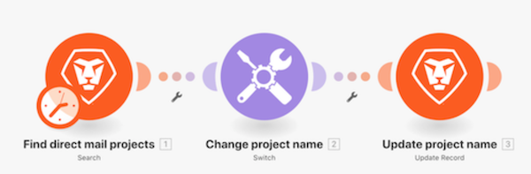

# Genomgång av modulen Byt

Lär dig hur du använder modulen Byt när du behöver utföra mer komplexa eller dynamiska dataomformningar.

## Genomgång av modulen Byt

Workfront rekommenderar att du tittar på genomgången av videon innan du försöker återskapa övningen i din egen miljö.

>[!VIDEO](https://video.tv.adobe.com/v/335290/?quality=12&learn=on)

>[!TIP]
>
>Om du vill ha stegvisa instruktioner för hur du slutför genomgången går du till [Genomgång av modulen Byt](https://experienceleague.adobe.com/docs/workfront-learn/tutorials-workfront/fusion/exercises/switch-module.html?lang=en) träna.

## Vill du veta mer? Vi rekommenderar följande:

[Workfront Fusion - dokumentation](https://experienceleague.adobe.com/docs/workfront/using/adobe-workfront-fusion/workfront-fusion-2.html?lang=en)
