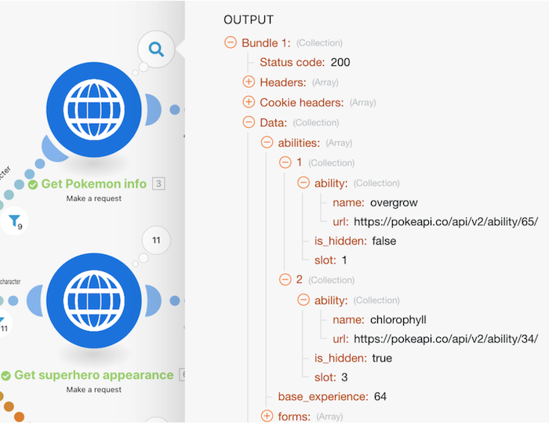

# Genomgång av matriser

Granska tidigare genomgångar där enkla och komplexa arrayer användes. Vi ska granska hur vi hittade dessa och hur vi använder informationen med hjälp av matrisfunktioner om det behövs.

## Genomgång av matriser

Workfront rekommenderar att du tittar på genomgången av videon innan du försöker återskapa övningen i din egen miljö.

>[!VIDEO](https://video.tv.adobe.com/v/335299/?quality=12&learn=on&enablevpops)

## Vill du veta mer? Vi rekommenderar följande:

[Workfront Fusion-dokumentation](https://experienceleague.adobe.com/sv/docs/workfront-fusion/using/get-started-with-fusion/understand-workfront-fusion/workfront-fusion-overview)
