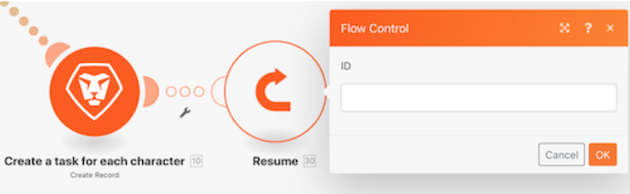

# Förstå felhanteringsdirektiv

I den här videon får du lära dig:

* De tre felhanterardirektiven som tillåter körning
* De två felhanterardirektiven som stoppar körningen

>[!VIDEO](https://video.tv.adobe.com/v/335305/?quality=12&learn=on)

## Direktiv - scenariot fortsätter

### Återuppta

* Ett ersättningsutdata anges och skickas till modulen som påträffar ett fel.
* De efterföljande modulerna bearbetas.
* Scenariots körningsstatus är markerad som &quot;success&quot;.

### Brytning

* Scenario-körningens tillstånd lagras i kön med ofullständiga körningar där felet kan lösas manuellt. Det finns dock vissa undantag som nämns här.
* De efterföljande modulerna bearbetas inte.
* Om det finns obearbetade paket fortsätter scenariokörningen normalt.
* Scenariots körningsstatus är markerad som &quot;varning&quot;.

### Ignorera

* Felet ignoreras och efterföljande moduler bearbetas inte.
* Om det finns obearbetade paket fortsätter scenariokörningen normalt.
* Scenariots körningsstatus är markerad som &quot;success&quot;.

## Direktiv - Scenariostopp

### Återställning

* Scenariokörningen stoppas omedelbart och en återställningsfas startas på alla moduler i ett försök att återställa alla till deras ursprungliga tillstånd.
* De efterföljande modulerna bearbetas inte.
* Om du utelämnar ett fåtal feltyper inaktiveras scenariot efter det&quot;antal på varandra följande fel&quot; som anges i scenarieinställningarna.
* Scenariots körningsstatus är markerad som &quot;error&quot;.

>[!NOTE]
>
>Detta är standardbeteendet om ingen felhanterarväg är kopplad till modulen och inställningen Tillåt lagring av ofullständiga körningar under scenarieinställningarna inte är markerad.

### Verkställ

* Felet ignoreras och efterföljande moduler bearbetas inte.
* Om det finns obearbetade paket fortsätter scenariokörningen normalt.
* Scenariots körningsstatus är markerad som &quot;success&quot;.

