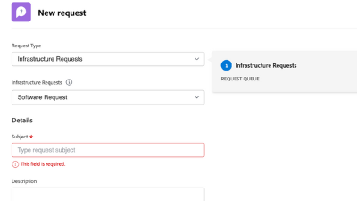

# Workfront Tutorials {#overview}

Ett bibliotek med utbildningsvideor och artiklar som hjälper dig att förstå Workfront funktioner och inställningar bättre.  Här finns en samling bästa praxis, kurser och andra resurser som hjälper både dig och din organisation att lyckas med Workfront.

>[!VIDEO](https://video.tv.adobe.com/v/335063/?quality=12&learn=on)

<!-- 

This is the landing page of the user guide. It should be the first list item in the TOC.md file. 
See other user landing pages to get ideas. 

-->

## Vad är nytt?

Upptäck de senaste uppdateringarna av självstudiekurserna för varje produktrelease från Workfront. Det här är vad som uppdaterades i den senaste versionen:

* Favoriter och ikon för senaste har delats upp i den övre navigeringen i Workfront. I <a href="/help/manage-work/projects/find-projects.md">Hitta projekt</a> självstudiekurs.

* Konfigurera ett anpassat formulär så att det fungerar med flera objekttyper. Se hur i <a href="/help/custom-data/custom-forms/custom-forms-creating-and-sharing-a-custom-form.md">skapa och dela ett eget formulär</a> självstudiekurs.

## Personalval

<table style="margin-top: 0 !important">
  <tr>
   <td>
      
      

         <a href="/help/administration-and-setup/layout-templates/find-layout-templates.md"><strong>Söka efter och skapa layoutmallar</strong></a>
      

      

         <em>Lär dig hur du skapar en grundläggande layoutmall.</em>
      

    </td>
   <td>
      
      

         <a href="/help/manage-work/issues-requests/make-a-request.md"><strong>Gör en förfrågan</strong></a>
      

      

         <em>Lär dig hur du gör, visar och redigerar begäranden.</em>
      

<td>
      
      

         <a href="/help/reporting/basic-reporting/create-a-simple-report.md"><strong>Skapa en enkel rapport</strong></a>
      

      

         <em>Lär dig hur du skapar en enkel anpassad rapport.</em>
      

    </td>
  </tr>
</table>

