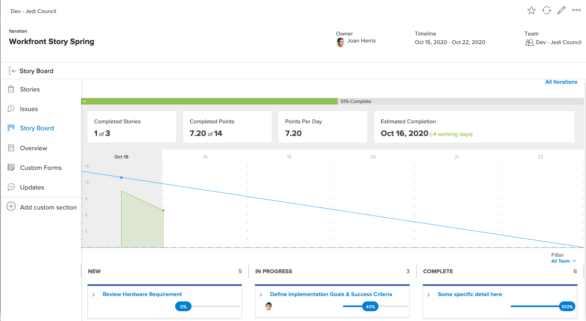
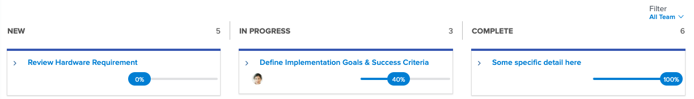

# Skapa synlighet med [!DNL Jira] Integrering

[!DNL Jira]  är en produkt som används för att spåra projekt och problem för utvecklingsteam och supportteam. Många team använder Jira för att spåra förloppet på aktivitetsnivå, men de använder [!DNL Workfront] att hantera projekt på ett riktigt sätt eftersom de kan få en förloppsvy på hög nivå. Med [!DNL Jira]  inbyggd integrering kan den här informationen automatiskt överföras mellan de två programmen.

## Vad är [!DNL Jira] ?

[!DNL Jira]  är en produkt som skapats av [!DNL Atlassian] för att spåra projekt och problem för utvecklingsteam och supportteam. Många team använder [!DNL Jira]  för att spåra arbetsuppgifterna, men de använder också [!DNL Workfront] för att hantera projekt. Detta innebär att teamen fördubblar sina insatser genom att skapa uppgifter både i [!DNL Workfront] och [!DNL Jira] . Men med [!DNL Jira]  inbyggd integrering kan den typen av information automatiskt överföras mellan de två programmen.

## Vad kan en [!DNL Jira]  vad ingår?

Här har vi en spruta [!DNL Workfront] titled &quot;[!DNL Workfront] Story Spring.&quot;

Joan Harris, ledaren för rådet Agile, för Dev-Jedi, använder styrbrädan och nedbränningsdiagram som ett sätt att mäta utvecklingen av den övergripande fjädringen. Det ger teamet en bra visuell representation av vad som pågår. Dessutom innehåller denna information en rapport som granskas varje kvartal. Men de flesta i teamet uppdaterar [!DNL Jira] , inte [!DNL Workfront].

Joan har använt [!DNL Jira]  i flera år och tycker att det är ett bra sätt för dem att spåra enskilda uppgifter och/eller buggar som de har tilldelats att arbeta med. Men Joan behöver verkligen den informationen för att kunna ansluta till [!DNL Workfront] och i slutänden mata in rapporterna från cheferna.

Via [!DNL Jira]  inbyggd integrering, uppdateringar av uppgifter, artiklar eller buggar kan automatiskt uppdatera uppgifter, artiklar och/eller problem i [!DNL Workfront].

Så när teammedlemmen som tilldelats artikeln Granska maskinvarukrav gör en uppdatering av statusen i [!DNL Jira] , och när du flyttar den från&quot;Nytt&quot; till&quot;Pågår&quot;, ändras status automatiskt för artikeln i [!DNL Workfront] också.

