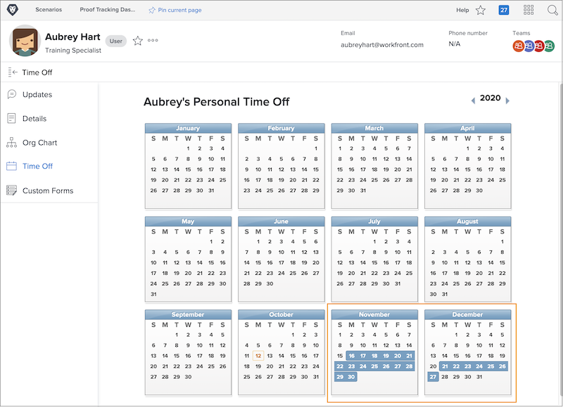
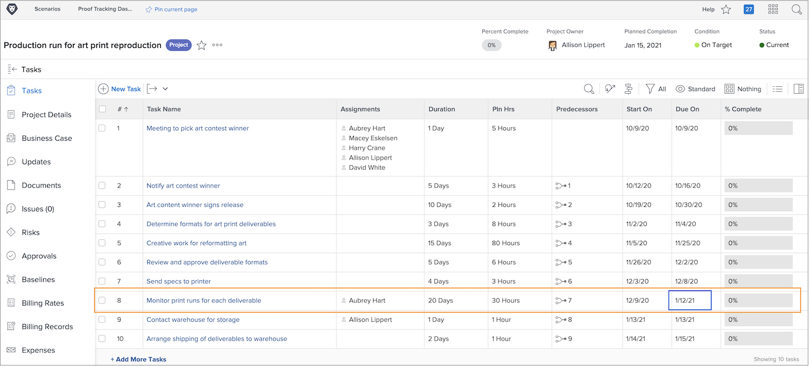
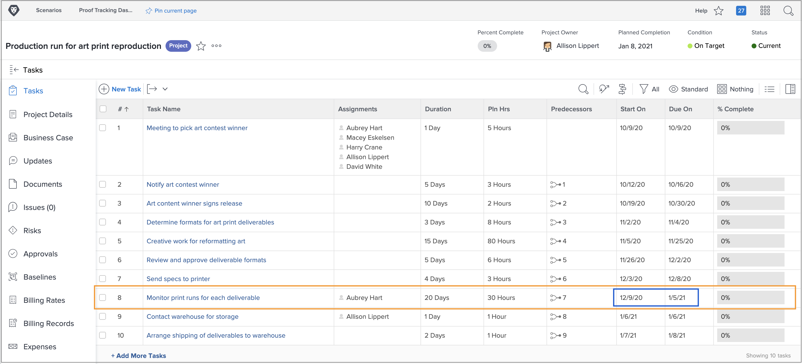

# Hur ledig tid påverkar projektets tidslinjer

Huruvida en tilldelad användares tid över faktorer till projekttidslinjen är beroende av en projektinställning som kallas [!UICONTROL användartid av]. Den här inställningen avgör om tidpunkten för den primära tilldelaren av uppgiften justerar de planerade datumen för aktiviteten i projektet.

Låt oss titta på vad som händer med en projekttidslinje när var och en av inställningarna är markerad - C[!UICONTROL överväg användarens tid när aktiviteten varar] eller [!UICONTROL Ignorera användarens tid när aktiviteten varar].

## Överväg användarens ledig tid i aktivitetsvaraktigheter

Det här alternativet är Workfront standardinställning.

I det här exemplet har den primära tilldelaren för uppgiften dagar kvar markerade i sin personliga kalender.

Projektledaren vill tilldela den här personen till en aktivitet som har planerade datum som överlappar användarens lediga tid.

När den här användaren tilldelas till uppgiften justeras de planerade datumen automatiskt. Nu har aktivitetens planerade slutförandedatum förlängts med flera dagar för att passa användarens ledig tid. Det är viktigt att notera att den här ändringen kan påverka planerade datum för andra uppgifter i projektet och eventuellt projektets planerade slutförandedatum.

## [!UICONTROL Ignorera användartid för aktivitetsvaraktigheter]

Med det här alternativet behålls de planerade datumen för aktiviteten som de ursprungligen var planerade, även om den primära tilldelande har en ledig tid under aktivitetens varaktighet.

Teammedlemmen har dagar borta markerade i sin kalender.

Projektledaren tilldelar dem en uppgift som överlappar ledigt. När användaren har tilldelats förblir de planerade aktivitetsdatumen som de ursprungligen var planerade.

För att arbetet ska kunna utföras i tid kan det vara bra att tilldela en annan person som kan arbeta med uppgiften medan den ursprunglige personen är utanför kontoret.

## Justera inställningen på projektnivå

Så här ändrar du inställningen för användartid av i ett projekt:

* Öppna projektet genom att klicka på dess namn i Workfront.

* Välj [!UICONTROL Redigera] på menyn med tre punkter i sidhuvudet till höger om projektnamnet.

* Bläddra till avsnittet [!UICONTROL Projektinställningar] och hitta fältet [!UICONTROL Användartid av].

* Välj det alternativ som du vill använda för det här projektet: [!UICONTROL Överväg användarens tid i aktivitetsvaraktigheter] eller I[!UICONTROL Ignorera användarens tid i aktivitetsvaraktigheter].

* Klicka på knappen [!UICONTROL Spara] i fönstrets övre högra hörn.

**Obs!**: Den här inställningen är inte tillgänglig om du väljer [!UICONTROL Projektinformation] på projektsidans vänstra panelmeny.

En global inställning för detta finns i projektinställningarna på menyn [!UICONTROL Inställningar] . Den här inställningen hanteras av systemadministratören. Gruppadministratörer kan eventuellt justera den här inställningen för de grupper som de hanterar.

Workfront rekommenderar att inställningen är den inställning du vill att de flesta av dina projekt ska hantera time off i organisationen.

Inställningen kan även byggas in i projektmallar med hjälp av mallinformationen.
