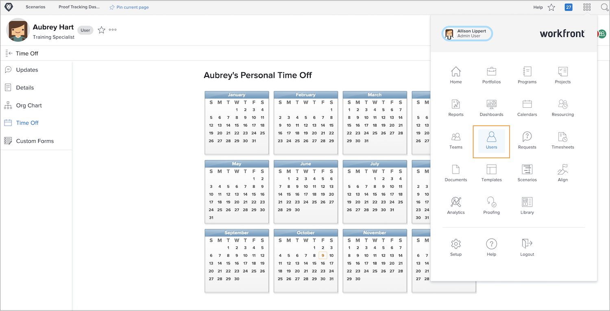

# Hantera andra användares ledig tid

Chefer och andra chefer kan hantera teammedlemmarnas tidskalendrar om de har behörigheten Redigera användare tilldelad via sin åtkomstnivå i Workfront. Åtkomstnivåer skapas och tilldelas av Workfront systemadministratörer.

Workfront rekommenderar att din organisation har en policy eller procedur för när en chef uppdaterar en anställds personliga tid i kalendern.

Så här hanterar du en annan användares kalender:

* Klicka på [!UICONTROL Huvudmenyn] och välj Användare.

* Använd sökikonen för att hitta användaren eller bläddra igenom listan.

* Klicka på användarens namn i listan.

* Klicka på [!UICONTROL Stäng av] på den vänstra panelmenyn på användarens profilsida.

* Klicka på ett datum i kalendern.

* Workfront antar att det är en hel dag ledigt. Om så är fallet klickar du på knappen [!UICONTROL Spara].

* Om du har flera dagar i följd ledigt ändrar du till sista dagen på kontoret. Klicka på knappen [!UICONTROL Spara].

* Om du markerar en partiell dag som ledig avmarkerar du kryssrutan [!UICONTROL Alla dagar]. Ange sedan timmarna som användaren ska arbeta den dagen (timmarna de är tillgängliga). Klicka på knappen [!UICONTROL Spara].
