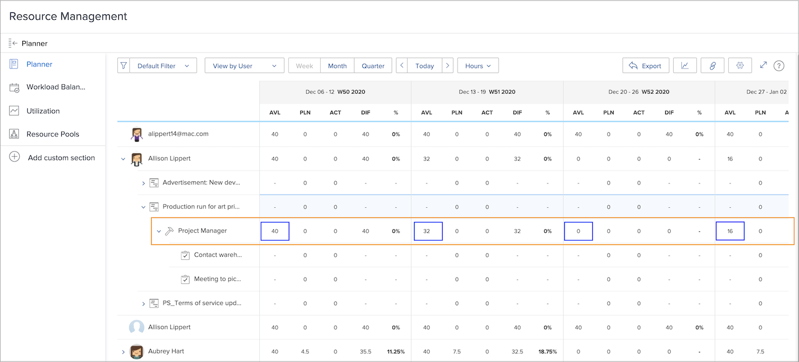
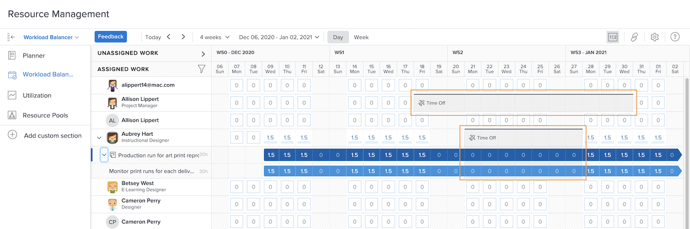

# Synlighet i resurshanteringsverktyg

Att veta vem som är tillgänglig och när är avgörande för resursplanering och resurshantering. När användare avmarkerar sin personliga tid i kalendern i Workfront kan den informationen också visas i Workfront resursverktyg.

## Resursplanering

En användares lediga tid visas i kolumnen Tillgänglig (AVL) i resursplaneraren. Workfront subtraherar den tid som är markerad i kalendern från den tillgängliga tiden, enligt Workfront beräkning baserat på tilldelat schema, procentvärde för jobbroll osv.

## Utjämning av arbetsbelastning

I Arbetsbelastningsutjämnaren visas ledig tid som grå staplar i kalendern. Denna synlighet hjälper resursansvariga och andra att fatta mer välgrundade beslut när de tilldelar arbete.

Tidsgränsen för indikatorn förhindrar dock inte att arbete tilldelas användaren via Utjämning av arbetsbelastning. Om arbete tilldelas visar Utjämning av arbetsbelastning att personen är övertilldelad under periodens tid.

