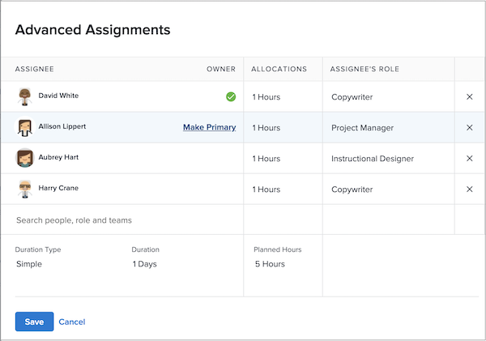

# Vad är en primär tilldelad person?

En primär tilldelad person finns när två eller flera användare har tilldelats en uppgift. Tidpunkten i den primära tilldelningens kalender är den som Workfront tittar på när inställningen för användartid är inaktiverad används.

Ta reda på vem som är den primära tilldelade personen på projektsidan. Klicka i fältet Uppdrag och klicka sedan på ikonen för avancerade uppdrag i hörnet.

I fönstret Avancerade uppdrag får den primära tilldelaren, eller uppgiftsägaren, en grön bockmarkering. Håll muspekaren över en annan användare och klicka på länken Gör primär för att ändra aktivitetens ägare.

 har valts

Du kan även justera den primära tilldelaren från uppgiftssidan. Markera kryssrutan för uppgiften i projektlistan och klicka sedan på ikonen Redigera. Bläddra till avsnittet Uppdrag och klicka på knappen för att ange aktivitetsägaren.

