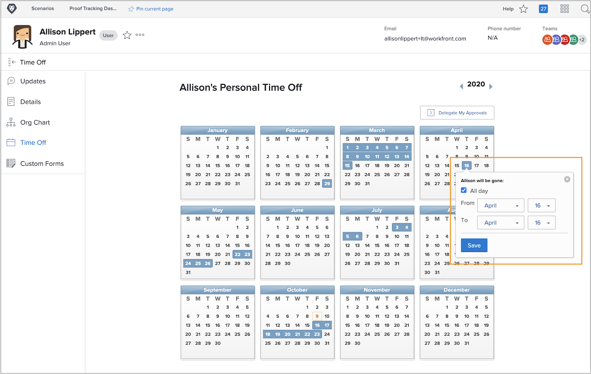

# Varför ska jag använda kalendertiden?

När projektledare och projektledare tilldelar uppgifter i Workfront kan man vara säker på vilka teammedlemmar som kan slutföra det tilldelade arbetet och på så sätt slutföra projektet i tid.

Exakta tillgänglighetsdata spelar också in i den aktuella och framtida arbetsplaneringen när resurshanterarna granskar allokeringen i Workfront resursplanerings- och hanteringsverktyg.

Användare av Workfront Work- och Plan-licenser kan använda den personliga kalendertiden för att ange när de inte är tillgängliga under normal arbetstid. Även en halv dag kan påverka slutförandet av uppgifter som tilldelats dem.

**Obs!** Workfront är inte utformat för att replikera eller ersätta din organisations befintliga system för att hantera, periodisera eller spåra ledig tid. Följ riktlinjerna från er organisation för att begära och hantera ledig tid.

## Markera din tid som ledig

Din personliga tid i kalendern finns på din användarsida i Workfront, som du kommer åt från huvudmenyn. Klicka på ditt namn i det vänstra hörnet.

* Klicka på Stäng av i den vänstra panelmenyn på din användarsida i Workfront.

* Som standard visas det aktuella året. Använd vid behov pilarna för att välja ett annat år (högst upp till höger i kalenderfönstret).

* Klicka på ett datum i kalendern.

* Workfront antar att du är ledig hela dagen. Om så är fallet klickar du på knappen Spara.

* Om du startar fullständiga dagar i följd ändrar du Till-datumet till sista dagen på kontoret. Klicka på knappen Spara.

* Om du inte vill ta bort hela dagen avmarkerar du rutan Heldag. Ange sedan timmarna du ska arbeta den dagen (timmarna du är tillgänglig). Klicka på knappen Spara.

Din lediga tid anges med blå rutor i kalendern. Den här gången visas den även på andra platser i Workfront för att underlätta projekt- och resursplanering.

**Pro-tip**: Om en aktivitet redan har tilldelats dig och du sedan markerar en ledig tid i kalendern, skickas inget meddelande till projektledaren som talar om att du inte är tillgänglig. Var noga med att uppdatera projektledaren med en ny tidpunkt som kan påverka aktuella projekt eller det arbete du har tilldelats.
