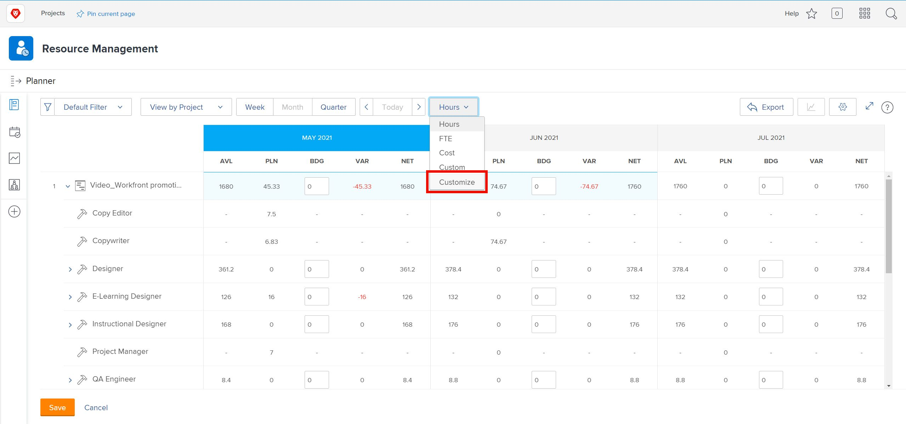
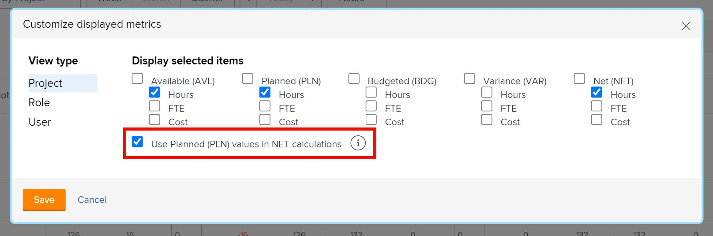

# Visa efter projekt i [!DNL Resource Planner]

I den här videon kommer du att:

* Se [!UICONTROL Visa efter projekt ]visa
* Lär dig hur resursinformation visas i den här vyn

>[!VIDEO](https://video.tv.adobe.com/v/335170/?quality=12)

För alternativet Visa efter projekt är standardvärdet att visa kolumnen Budgeterad, som tar upp det uppskattade antalet resurser som behövs för ett projekt från ett affärsärende, om det har fyllts i. Det innebär också att kolumnen Netto som standard använder siffrorna från kolumnen Budgeterad för att ange hur många resurser som finns kvar.

Din organisation kanske inte använder, eller är redo att använda, affärsärenden för att beräkna beloppen. Använd i stället de planerade timmar som redan har angetts i ett projekt. Med alternativet Anpassa kan du välja vilka kolumner som ska visas i den vy du väljer och hur du vill att Net-kolumnen ska beräknas.

Så här ändrar du kolumnerna som visas och beräkningen av Net-kolumnen så att den baseras på planerade timmar:

* Klicka på listrutan Timmar och välj Anpassa.

* I rutan Anpassa visade mått anger du vilka kolumner som ska visas och markerar kryssrutan bredvid Använd planerade värden (PLN) i NET-beräkningar.

**Anteckning**: Du kan redigera kolumner och beräkningar för de olika vytyperna i Resursplanering genom att välja ett alternativ till vänster i rutan.

* När du klickar på Spara stängs rutan och skärmen uppdateras.

Resursplaneraren visar vad du behöver veta om tillgång och efterfrågan utan komplexa kalkylblad och kommunikation i realtid.

Med den information som finns till hands och verktygen till hands kan ni finjustera teamets kapacitet och utföra det arbete som är viktigt för er.
