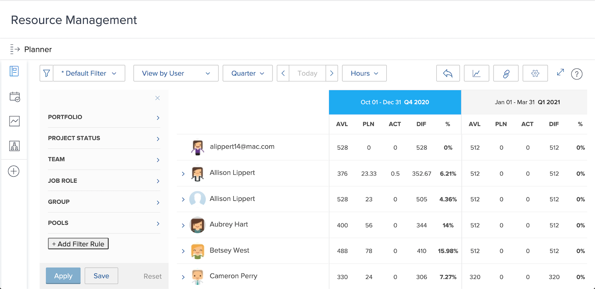

# Visa användning och filtrera resursplaneraren

Med Resursplaneraren får du en tydlig bild av de projekt du är intresserad av och en realtidsöversikt över hur medarbetarna staplar sig för att genomföra dem.

* Du vill t.ex. veta vad som händer med kapaciteten när den senaste serveruppdateringssatsningen blir din högsta prioritet.

* Resursplaneringen visar personalens tillgänglighet och hur resurstilldelning till ett projekt kommer att påverka tillgängligheten i projekt med låg prioritet.

Ni kommer inte bara att se hur resursallokeringen påverkar dagens arbete, utan även om ni ser bortom era omedelbara behov av resursplanering kan ni utvärdera långsiktiga resursallokeringar för att förstå om individer är över (eller under) allokerade.

## Filtrera resursplaneraren

Resursplaneraren öppnas automatiskt med en standarduppsättning med filter. Du vill redigera dessa filter genom att:

* Tidsram
* Portfolio/Program
* Resurspooler osv.

På så sätt kan du fokusera på vilka resurser som är tillgängliga och när.
