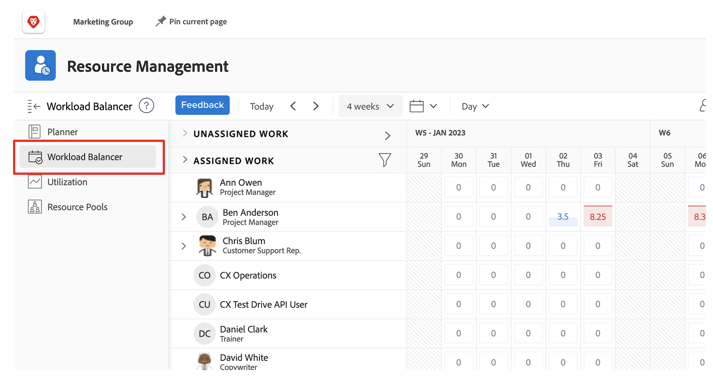

# Hitta [!DNL Workload Balancer]

Att veta vilka resurser som är tillgängliga och hur de ska distribueras kan vara en utmaning för alla. Därför skapade Workfront [!DNL Workload Balancer].

Syftet är att ge er bättre insikt i och hantering av den dagliga och veckovisa arbetsbördan för de personer ni hanterar. Detta hjälper er att göra bättre uppdrag, baserat på roll och tillgänglighet, i flera projekt.

* Klicka på [!UICONTROL Resurser] på [!UICONTROL Huvudmenyn].
* Gå till avsnittet [!UICONTROL Schemaläggning] i området Resurshantering.
* Klicka på avsnittet [!UICONTROL &quot;Utjämning av arbetsbelastning&quot;] som visas.

## Områden i arbetsbelastningsutjämnaren

Två avsnitt visas i [!DNL Workload Balancer]: Tilldelat arbete och Ej tilldelat arbete.

På arbetsytan Tilldelad visas en lista med användare och det arbete de redan har tilldelats inom Workfront. Som standard filtreras det här området efter användare som ingår i de Workfront-team som du tillhör. På det här sättet ser du vilka gruppmedlemmar som har tilldelats att arbeta med.

Arbetsytan Ej tilldelat arbete visar arbete som fortfarande behöver tilldelas, oavsett om det är en person, en jobbroll eller ett team. Inledningsvis visas dock ingenting i det här området.

Genom att börja med Ej tilldelad arbetsyta tom kan du först fokusera på användarnas aktuella arbetsbelastningar, i området Tilldelad arbetsyta, innan du gör tilldelningar.
