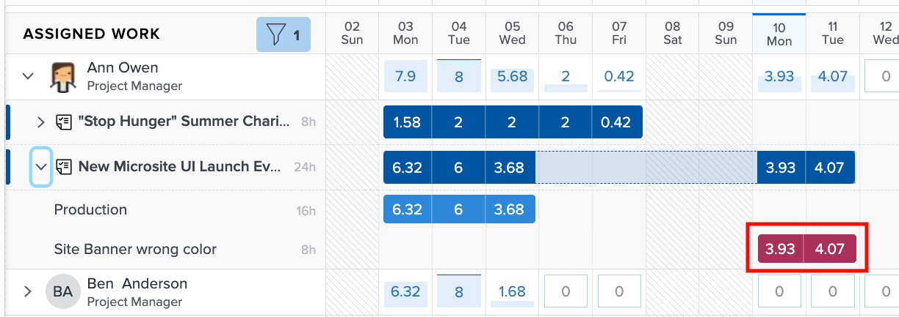
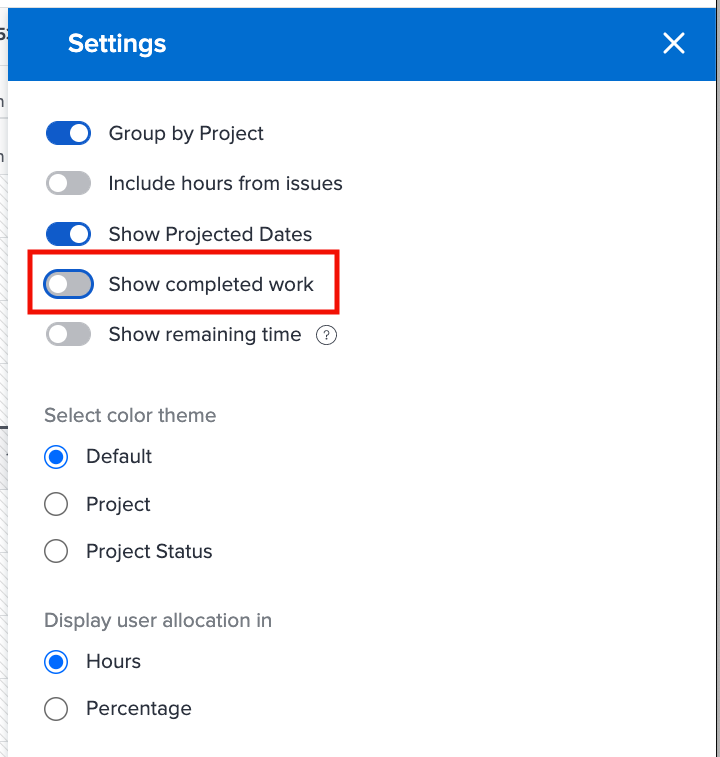

# Inställningar som ska beaktas för belastningsutjämnaren

Det finns ett par inställningar för belastningsutjämnare:

* Utfärdar tilldelningar
* Planerade datum
* Slutfört arbete

Du kan aktivera och inaktivera dem med hjälp av ikonen Inställningar för belastningsfördelning.

## Inkludera timmar från utleveranser

Som standard visas endast uppgifter i Utjämning av arbetsbelastning. Användarna kan dock tilldelas till förfrågningar och frågor som behöver uppfyllas eller lösas, och som tar så lång tid att de kan lägga ned på projektarbete.

Workfront rekommenderar att du tar med frågor i listan över tilldelade användaruppgifter för att få en bättre förståelse för hur mycket arbete en användare har.

Markera bara alternativet Inkludera timmar från problem i området Inställningar för belastningsutjämnare för arbetsbelastning.

I området Tilldelad arbetsyta visas problemen som ljusa markeringsramar.

### Projektdatum

Ett annat alternativ som är tillgängligt via inställningarna för Utjämning av arbetsbelastning är att visa arbetsbelastningar baserat på planerade datum.

Standardinställningen visar tilldelat arbete baserat på de planerade datum som anges i projektet.

Eftersom beräknade datum baseras på förloppet och slutförandet av tidigare uppgifter i projektet kan du få en realtidsvy över när en uppgift ska påbörjas eller slutföras, vilket är särskilt användbart när du tittar på arbetsbelastningar.

Du kan växla mellan att visa planerade och planerade datum med alternativet Visa planerade datum i inställningarna för Utjämning av arbetsbelastning.

### Slutförda uppgifter

Slutförda uppgifter visas i Utjämning av arbetsbelastning tillsammans med de som för närvarande pågår eller som ska börja. För att få en bättre förståelse för vilka ytterligare arbetsmoment användarna kan utföra kanske du vill utesluta det färdiga arbetet.

Avmarkera alternativet Visa slutfört arbete i inställningarna för Utjämning av arbetsbelastning.

