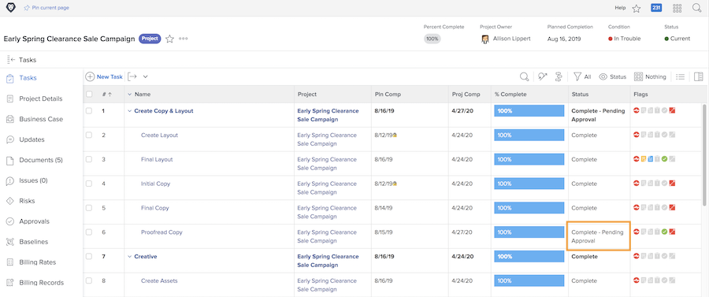

# Fullständiga godkännanden

Godkännanden av uppgifter och ärenden ingår i många arbetsflöden. Men olösta godkännanden kan hindra dig från att ange projektstatus till Fullständigt.

På [!UICONTROL Uppgift] väljer du [!UICONTROL Visa] som innehåller [!UICONTROL Status] kolumn. En snabbtitt på den kolumnen visar om en uppgift med &quot;[!UICONTROL -godkännande väntar]&quot; efter statusens namn.

Du kan välja vad du vill göra:

* **Slutför godkännandet -** Detta kan innebära att man måste påminna andra om godkännandet. Gör detta med en uppdatering genom [!DNL Workfront]. Beroende på din [!DNL Workfront] kan du själv slutföra godkännandet.
* **Ta bort godkännandet —** Om godkännandet inte behövs kan det vara enklare att bara ta bort det. Din förmåga att göra detta beror på din [!DNL Workfront] behörigheter.
* **Ändra status —** Välj en status som inte har ett godkännande bifogat. Se bara till att statusen är lika med Fullständig.

Om din organisation använder problem för att spåra problem, ändringsorder eller andra händelser under projekt följer du samma steg i [!UICONTROL Problem] del av projektet.
