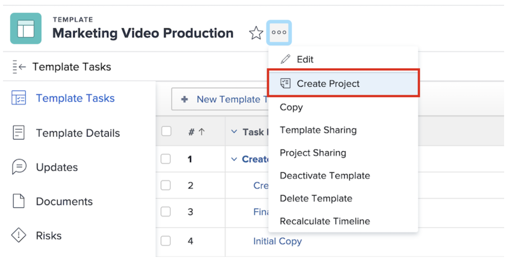

# Skapa ett projekt direkt från en mall

Om du arbetar med en mall och behöver skapa ett projekt med den mallen klickar du på menyn med tre punkter bredvid mallnamnet. Välj sedan Skapa projekt.

I informationsfönstret kan du ändra inställningarna för det nya projektet.

>[!NOTE]
>
>Om du vill skapa ett projekt med den här metoden måste du ha tillgång till mallområdet i Workfront. Om du inte har tillgång till mallar kan du fortfarande använda en mall för att skapa ett projekt från projektområdet eller när du konverterar ett problem eller en uppgift.

**Pro-Tip**: Om det finns en mall som du använder ofta kan du göra den till en favorit! Mallen visas på menyn Nytt projekt, förutom att den visas på menyn Favoriter och Senaste i navigeringsfältet.

